A seguir é apresentado o processo de contrução de uma API em Node.js.  
Ela foi escrita em TypeScript e utiliza o framework [Fastify](https://fastify.dev/).  
Algumas bibliotecas são utilizadas, como:  

[Zod](https://zod.dev/)  
[ESLint](https://eslint.org/)  
[TypeORM](https://typeorm.io/)  
E outras apresentadas no decorrer projeto.

Esta documentação é uma síntese do projeto apresentado por [Gustavo Henrique de Lima Oliveira](https://github.com/GustavoLima93) no curso de [pós-graduação em desenvolvimento full-stack da FIAP](https://postech.fiap.com.br/curso/full-stack-development/).  

No entanto, nos registros constam anotações e modificações pessoais. O projeto original pode ser encontrado [aqui](https://github.com/GustavoLima93/nodejs_integracao_banco_fiap/tree/main).  

# Passos para iniciar o dsenvolvimento da aplicação do zero:

## Antes de iniciar:

Você precisará dos seguintes recursos instalados na sua máquina:  

[Node.js](https://nodejs.org/pt/download)  
[Docker](https://docs.docker.com/engine/install/) para criar um container PostgreSQL.  
[DBeaver](https://dbeaver.io/download/) para conectar-se ao banco de dados PostgreSQL.  
[Postman](https://www.postman.com/downloads/) para realizar requisições http.

## 1. Crie o arquivo .npmrc na raiz do projeto:
**.npmrc** é o arquivo onde serão armazenadas as informações do npm por questões de segurança. Nele é possível, por exemplo, inserir:  

```registry=REPOSITORIO_PARA_BAIXAR_DEPENDENCIAS```  

Nesse projeto, insira o código a seguir:  

```save-exact=true```  

O código acima salva as versões exatas das bibliotecas que serão utilizadas.  

## 2. Inicie a aplicação Node.js:

```npm init -y```  

## 3. Instale os pacotes de desenvolvimento:

```npm i -D @types/node tsup tsx typescript```  

**tsup** é o transpiler, que vai converter nosso código de TypeScript para JavaScript.  
**tsx** é uma bibilioteca para executar o código TypeScript em ambiente de desenvolvimento.  
**typescript** é o TypeScript em si.  

## 4. Instale o Fastfy:

```npm i fastify```  

**Fastify** é um web framework rápido e simples baseado no express e no Hapi.  

## 5. Crie os principais arquivos da aplicação:

**Arquivo:** /src/app.ts  
<details>
<summary>Ver conteúdo</summary>  

```
import fastify from "fastify";
export const app = fastify();
```
</details>

**Arquivo:** /src/server.ts   
<details>
<summary>Ver conteúdo</summary>  

```
import { app } from "./app";

app.listen({
    host: '0.0.0.0',
    port: 3030
}).then(() => {
    console.log('HTTP server running on http://localhost:3030')
})
```  
</details>  

**app.ts** conterá todas as principais configurações para executar a API.  
**server.ts** onde serão expostas as configurações do servidor web.  

## 6. Instale as bibliotecas Zod e Dotenv:

```npm i dotenv zod```

**Zod** é uma biblioteca que fará validação de schemas. Quando enviarmos uma requisição ou objeto, o Zod é capaz de ler o objeto e verificar se o que foi enviado corresponde ao esperado.
**Dotenv** é uma biblioteca para adicionar variáveis de ambiente ao processo do Node.js.

## 7. Crie os arquivos .env e .env.example na raiz do projeto:

**Arquivo:** .env  
<details>
<summary>Ver conteúdo</summary>  

```
PORT=3030
ENV=development
DATABASE_USER=seu-nome-de-usuario*
DATABASE_HOST=localhost
DATABASE_NAME=nome-do-seu-banco*
DATABASE_PASSWORD=sua-senha*
DATABASE_PORT=5432
```  
</details>  

**Arquivo:**  .env.example  
<details>
<summary>Ver conteúdo</summary>  

```
PORT=
ENV=
DATABASE_USER=
DATABASE_HOST=
DATABASE_NAME=
DATABASE_PASSWORD=
DATABASE_PORT=
```  
</details>  

**.env** contém as configurações de ambiente.  
**.env.example** é um exemplo para que outras pessoas desenvolvedoras saibam quais são as configurações necessárias para executar o projeto.  
**Importante:** Quando fizer o upload do projeto para o repositório não inclua o arquivo ```.env``` porque ele possui informações sensíveis.  
**\*:** Essas informações serão criadas posteriormente na [etapa de criação do banco de dados](#14-crie-um-banco-de-dados).  
**Importante:** Será utilizada a porta 3030 nos exemplos de requisições. Caso tenha optado por uma porta diferente você deverá fazer adaptações para que elas funcionem.

## 8. Crie um arquivo para gerenciar as variáveis de ambiente:

**Arquivo:**  /src/env/index.ts  
<details>
<summary>Ver conteúdo</summary>  

```
import 'dotenv/config'

import { z } from 'zod'

const envSchema = z.object({
  NODE_ENV: z
    .enum(['development', 'test', 'production'])
    .default('development'),
  PORT: z.coerce.number().default(3030),
  DATABASE_USER: z.string(),
  DATABASE_HOST: z.string(),
  DATABASE_NAME: z.string(),
  DATABASE_PASSWORD: z.string(),
  DATABASE_PORT: z.coerce.number(),
})

const _env = envSchema.safeParse(process.env)

if (!_env.success) {
  console.error('Invalid environment variables', _env.error.format())

  throw new Error('Invalid environment variables')
}

export const env = _env.data
```  
</details>  

Esse arquivo gerencia e valida as variáveis de ambiente, garantindo que todas elas tenham valores corretos antes da aplicação ser iniciada.  
**.enum()** diz que a variável NODE_ENV deve ser uma das opções apresentadas.  
**.default()** define um valor padrão caso a variável não esteja definida.  
**.number()** diz que a variável PORT deve ser um number.  
**coerce** força a conversão do valor da variável PORT recebido do arquivo ```.env``` de string para number. Ou seja, faz um casting para number.  
**_env** recebe a validação das variáveis de ambiente do Node.js (definidas no arquivo ```.env```) realizada pelo contrado definido por **envSchema**. Caso a validação seja bem sucedida, os dados são exportados em **env** que contém ```_env.data```.  
Os valore de **DATABASE_USER**, **DATABASE_HOST**, **DATABASE_NAME**, **DATABASE_PASSWORD** e **DATABASE_PORT** serão obtidos na [etapa de criação do banco de dados](#14-crie-um-banco-de-dados).

## 9. Importe as variáveis de ambiente:

Agora que as variáveis de ambiente já estão definidas e validadas, utilize-as na configuração do serivor editando o arquivo ```/src/server.ts```. 

**Arquivo:** /src/server.ts   
<details>
<summary>Ver conteúdo</summary>  

```
import { env } from "./env";
import { app } from "./app";

app.listen({
    host: '0.0.0.0',
    port: env.PORT
}).then(() => {
    console.log('HTTP server running on http://localhost:' + env.PORT)
})
```  
</details>  

## 10. Instale a biblioteca ESLint em ambiente de desenvolvimento:

```npm i -D @typescript-eslint/eslint-plugin@6.21.0 @typescript-eslint/parser@6.21.0 eslint@8.57.0 eslint-config-prettier@9.1.0 eslint-config-standard@17.1.0 eslint-plugin-import@2.29.1 eslint-plugin-n@16.6.2 eslint-plugin-prettier@5.1.3 eslint-plugin-promise@6.1.1 prettier@3.2.5```  

Esse comando fará a instalação do ESLint e de plugins que serão utilizados. As versões estão fixadas com @X.Y.Z. Caso queira instalar as versões mais novas disponíveis, é possível omitir esse trecho nos pacotes. O comando será:  

```npm i -D @typescript-eslint/eslint-plugin @typescript-eslint/parser eslint eslint-config-prettier eslint-config-standard eslint-plugin-import eslint-plugin-n eslint-plugin-prettier eslint-plugin-promise prettier```  

## 11. Configure o ESLint:

Crie o arquivo .eslintrv.json na raiz do projeto com a seguinte configuração:  

**Arquivo:** eslintrc.json   
<details>
<summary>Ver conteúdo</summary>  

```
{
    "env" : {
        "es2020": true,
        "node": true
    },
    "extends": [
        "standard",
        "plugin:@typescript-eslint/recommended",
        "plugin:prettier/recommended"
    ],
    "parser": "@typescript-eslint/parser",
    "parserOptions": {
        "ecmaVersion": "latest",
        "sourceType": "module"
    },
    "plugins": ["@typescript-eslint"],
    "rules": {
        "prettier/prettier": [
            "error",
            {
                "printWidth": 80,
                "tabWidth": 2,
                "singleQuote": true,
                "trailingComma": "all",
                "arrowParens": "always",
                "semi": false                
            }
        ],
        "camelcase": "off",
        "no-useless-constructor": "off"
    },
    "settings": {
        "import/parsers" : {
            "@typescript-eslint/parser": [".ts", ".d.ts"]
        }
    }
}
```  
</details>  

Essas são as configurações recomendadas para o ESLint.  
Caso esteja usando o VSCode, dependendo das suas configurações, o ESLint fará correções automáticas ao salvar os arquivos. Caso não faça, você pode encontrar os erros na aba "problems" do terminal, clicar sobre elas com o botão direito e selecionar a opção para consertar o erro. Conforme for escrevendo código, confira as correções sugeridas pelo ESLint.  

Caso queira defnir suas próprias, utilize o comando:  

```npx eslint init```  

## 12. Crie o arquivo .gitignore na raiz do projeto:

**Arquivo:** .gitignore  
<details>
<summary>Ver conteúdo</summary>  

```
/node_modules
/.env
```  
</details>  

**.env**  conteḿ informações que podem ser sensíveis.
**node_modules** é uma pasta muito grande e é boa prática não fazer seu upload para o respositório. Afinal, a pessoa desenvolvedora poderá obtê-la com o comando:  

```npm install```  

## 13. Configure o TypeScript:

Utilize o comando para criar o arquivo ```tsconfig.json``` na raiz do projeto:  
```npx tsc --init```  

Nesse arquivo, localize e altere os valores das seguintes chaves:  

**Arquivo:** tsconfig.json   
<details>
<summary>Ver conteúdo</summary>  

```
"target": "es2020",  
"baseUrl": "./",  
"paths": {  
    "@/*": ["./src/*"]  
},  
```  
</details>  

Reformule as importações no arquivo ```/src/server.ts```:  

**Arquivo:** /src/server.ts   
<details>
<summary>Ver conteúdo</summary>  

```
import { env } from '@/env'  
import { app } from '@/app'  

...  
```  
</details>  

## 14. Crie um banco de dados:

Nesse projeto será usado um banco de dados PostgrSQL.  
Você pode adaptá-lo para usar outro tipo de banco de dados.  
Com o [Docker](https://docs.docker.com/engine/install/) instalado no seu sistema operacional, rode o comando:  

```docker run -d --name postgres -e POSTGRES_USER=seu-nome-de-usuario -e POSTGRES_PASSWORD=sua-senha -e POSTGRES_DB=nome-do-seu-banco -p 5432:5432 postgres```  

Este comando cria um coainter PostgreSQL em que:  
**name** postgres, é o nome do container.  
**POSTGRES_USER** definirá seu nome de usuário, então escolha um adequado.  
**POSTGRES_PASSWORD** definirá a senha do seu usuário.  
**POSTGRES_DB** criará um novo banco de dados cujo nome será o valor passado para essa variável.  
**-p 5432:5432** está mapeando a porta 5432 local com a porta 5432 do container.  
**postgres** é o nome da imagem que será instalada.  

## 15. Configure o DBeaver para se conectar ao banco:

Adicione uma conexão de banco de dados ao [DBeaver](https://dbeaver.io/download/) como foi feito no exemplo a seguir:  

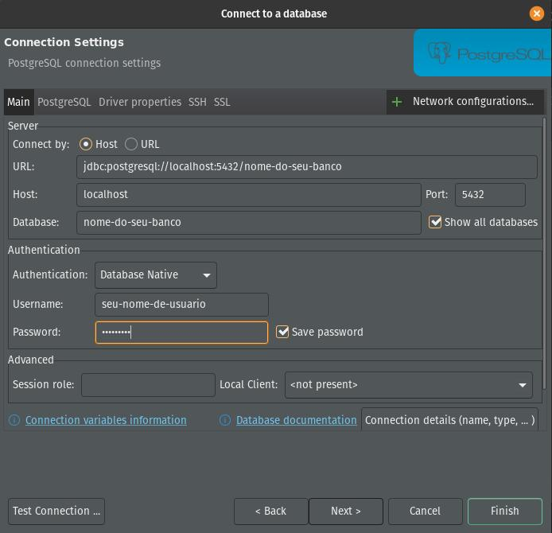  

## 16. Estruture o banco:

Abra o DBeaver e localize o banco de dados criado [na etapa correspondente](#14-crie-um-banco-de-dados).  
Clique sobre ele com o botão direit, vá em ```SQL Editor->New SQL script``` e insira o seguinte script:  

<details>
<summary>Ver conteúdo</summary>  

```
CREATE TABLE product (
id UUID PRIMARY KEY,
name VARCHAR(255) NOT NULL,
description TEXT,
image_url VARCHAR(255),
price DOUBLE PRECISION
);

CREATE TABLE category (
id SERIAL PRIMARY KEY,
name VARCHAR(255) NOT NULL,
creation_date TIMESTAMP WITHOUT TIME ZONE
);

CREATE TABLE product_category (
product_id UUID NOT NULL,
category_id SERIAL NOT NULL,
PRIMARY KEY (product_id, category_id),
FOREIGN KEY (product_id) REFERENCES product (id) ON DELETE CASCADE,
FOREIGN KEY (category_id) REFERENCES category (id) ON DELETE CASCADE
);

CREATE TABLE address (
    id SERIAL PRIMARY KEY,
    street VARCHAR(255) NOT NULL,
    city VARCHAR(255) NOT NULL,
    state VARCHAR(2) NOT NULL,
    zip_code VARCHAR(10) NOT NULL
);

CREATE TABLE person (
id BIGSERIAL PRIMARY KEY,
cpf VARCHAR(11) not null,
name VARCHAR(100) not null,
birth DATE not null,
email varchar(255) not null
);

alter table address 
add column person_id bigint not null;

alter table address 
add constraint fk_address_person
foreign key (person_id)
references person(id);

CREATE TABLE "user" (
    id SERIAL PRIMARY KEY,
    username VARCHAR(255) NOT NULL,
    password VARCHAR(255) NOT NULL
);

alter table person 
add column user_id int unique,
add constraint fk_user_id foreign key (user_id) references "user"(id);
```  
</details>  

Com o script inserido, selecione-o e execute-o clicando no notão indicado na imagem a seguir:  

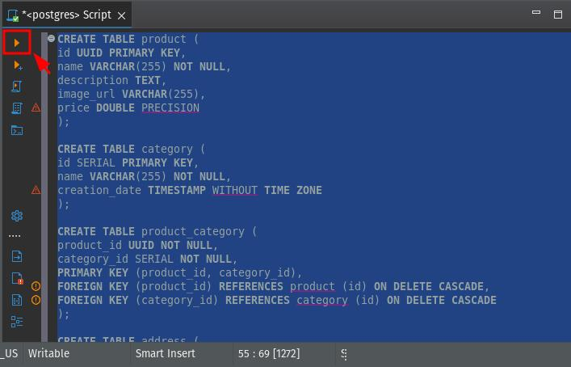  

Navegue até ```seu-banco->Schemas->public``` como mostrado na imagem a seguir.  

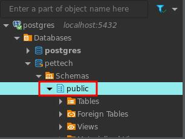  

Clique com o botão direito sobre ```public``` e em seguida, ```Refresh``` no menu que irá aparecer.  

Dê um duplo clique sobre ```public```. Na aba ```ER Diagram``` você pode visualizar a estrutura do banco, como na imagem a seguir.  

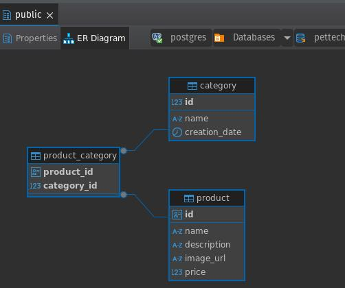  

## 17. Crie um diretório para as entidades:

Cada tabela será uma entidade. Então crie o diretório ```/src/entities``` que irá contê-las.  

Crie o arquivo ```/src/entities/person.entity.ts``` com o seguinte conteúdo:  

**Arquivo:** /src/entities/person.entity.ts  
<details>
<summary>Ver conteúdo</summary>  

```
export class Person {
  id?: number
  cpf: string
  name: string
  birth: Date
  email: string
  user_id?: number

  constructor(cpf: string, name: string, birth: Date, email: string) {
    this.cpf = cpf
    this.name = name
    this.birth = birth
    this.email = email
  }
}
```  
</details>  

## 18. Crie um diretório para os repositórios:

Crie o diretório ```/src/repositories```.  

Crie o arquivo ```/src/repositories/person.repository.ts``` com o seguinte conteúdo:  

**Arquivo:** /src/repositories/person.repository.ts  
<details>
<summary>Ver conteúdo</summary>  

```
import { Person } from '@/entities/person.enetity'

export class PersonRepository {
  async findById(id: number): Promise<Person> {
    return {
      id,
      cpf: '111.111.111-11',
      name: 'John Doe',
      birth: new Date('1990-01-01'),
      email: 'test@example.com',
      user_id: 1,
    }
  }

  async create(person: Person): Promise<Person> {
    return person
  }
}
```  
</details>  

Note que esse conteúdo é apenas um placeholder e será alterado no futuro.  

## 19. Crie um diretório para os uses cases:

Crie o diretório ```/src/use-cases```.  

Crie o arquivo ```/src/use-cases/create-person.ts``` com o seguinte conteúdo:  

**Arquivo:** /src/use-cases/create-person.ts  
<details>
<summary>Ver conteúdo</summary>  

```
import { Person } from '@/entities/person.enetity'
import { PersonRepository } from '@/repositories/person.repository'

export class CreatePersonUseCase {
  constructor(private personRepository: PersonRepository) {}

  handler(person: Person) {
    return this.personRepository.create(person)
  }
}
```  
</details>  

O método **handler** tem esse nome porque é o único método da classe que segue o princípio de [single responsibility](https://medium.com/@tbaragao/solid-s-r-p-single-responsibility-principle-2760ff4a7edc) do Solid.

## 20. Crie um diretório para os controllers:

Crie o diretório ```/src/http/controllers/person```.  

Crie o arquivo ```/src/http/controllers/person/create.ts``` com o seguinte conteúdo:  

**Arquivo:** /src/http/controllers/person/create.ts  
<details>
<summary>Ver conteúdo</summary>  

```
import { PersonRepository } from '@/repositories/person.repository'
import { CreatePersonUseCase } from '@/use-cases/create-person'
import { FastifyReply, FastifyRequest } from 'fastify'
import { z } from 'zod'

export async function create(request: FastifyRequest, reply: FastifyReply) {
  const registerBodySchema = z.object({
    cpf: z.string(),
    name: z.string(),
    birth: z.coerce.date(),
    email: z.string().email(),
  })

  const { cpf, name, birth, email } = registerBodySchema.parse(request.body)

  try {
    const personRepository = new PersonRepository()
    const createPersonUseCase = new CreatePersonUseCase(personRepository)

    await createPersonUseCase.handler({
      cpf,
      name,
      birth,
      email,
    })

    return reply.status(201).send()
  } catch (error) {
    console.log(error)

    throw new Error('Internal server error')
  }
}
```  
</details>  

## 21. Crie um arquivo para as rotas:

Crie o arquivo ```/src/http/controllers/person/routes.ts``` com o seguinte conteúdo.  

**Arquivo:** /src/http/controllers/person/routes.ts  
<details>
<summary>Ver conteúdo</summary>  

```
import { FastifyInstance } from 'fastify'
import { create } from './create'

export async function personRoutes(app: FastifyInstance) {
  app.post('/person', create)
}
```  
</details>  

## 22. Registre a rota criada

Edite o arquivo ```/src/app.ts``` deixando-o da seguinte forma:

**Arquivo:** src/app.ts  
<details>
<summary>Ver conteúdo</summary>  

```
import fastify from 'fastify'
import { personRoutes } from '@/http/controllers/person/routes'

export const app = fastify()

app.register(personRoutes)
``` 
</details>  

## 23. Crie scripts no package.json:

Edite o arquivo ```package.json``` na raiz do projeto. A chave "scripts" deve ter as seguintes entradas:

**Arquivo:** package.json  
<details>
<summary>Ver conteúdo</summary>  

```
...

"scripts": {    
    "start:dev": "tsx watch src/server.ts",
    "start": "node build/server.js",
    "build": "tsup src --out-dir build"
  },

...
```  
</details>

**start:dev** é o script usado para iniciar a aplicação em ambiente de desenvolvimento.  
**start** é o script usado para iniciar a aplicação em ambiente de produção.  
**build** é o script usado para transpilar o código TypeScript dentro do diretório ```src``` para JavaScript no diretório ```build```.  

Você pode executar esses scripts na raiz do projeto usando, respectivamente:
```
npm run start:dev
```  

```
npm run start
```  

```
npm run build
```  

**Importante:** antes de iniciar a aplicação em ambiente de produção com o comando ```npm run start``` é preciso transpilar o código com o comando ```npm run build```.  

## 24. Utilize o Postman para testar a aplicação:

Após executar o comando ```npm run start:dev```, crie no [Postman](https://www.postman.com/downloads/) uma requisição do tipo ```post``` para ```localhost:3030/person``` com o seguinte conteúdo no ```body```:  

<details>
<summary>Ver conteúdo</summary>  

```
{
    "cpf": "11122233344",
    "name": "Aurélio",
    "birth": "1985-01-01",
    "email": "email@email.com"
}
```  
</details>  

A imagem a seguir mostra como ficará a requisição:  

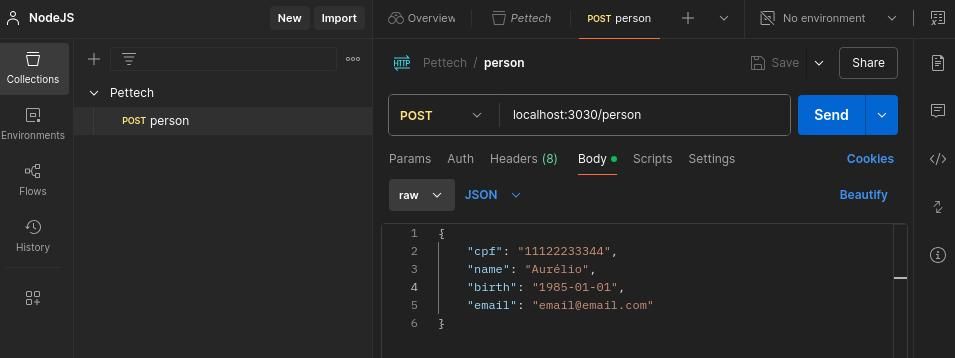  

Ao ser enviada, a requisição deverá retornar um status ```201```.  

## 25. Conecte a aplicação ao banco de Dados:

A primeira integração com banco de dados será feita pro meio do driver do PostgreSQL.  

Instale o pacote que o contém usando o comando:  

```npm i pg```  

Como o projeto está sendo desenvolvido com TypeScript, será necessário instalar os tipos em ambiente de desenvolvimento com o comando:  

```npm i -D @types/pg```  

Crie o arquivo ```db.ts``` e também seu diretório em ```/src/lib/pg/db.ts``` com o conteúdo:  

**Arquivo:** /src/lib/pg/db.ts  
<details>
<summary>Ver conteúdo</summary>  

```
import { Pool, PoolClient } from 'pg'
import { env } from '@/env'

const CONFIG = {
  user: env.DATABASE_USER,
  host: env.DATABASE_HOST,
  database: env.DATABASE_NAME,
  password: env.DATABASE_PASSWORD,
  port: env.DATABASE_PORT,
}

class Database {
  private pool: Pool
  private client: PoolClient | undefined

  constructor() {
    this.pool = new Pool(CONFIG)

    this.connection()
  }

  private async connection() {
    try {
      this.client = await this.pool.connect()
    } catch (error) {
      console.error(`Error connecting to the database: ${error}`)

      throw new Error(`Error connecting to the database: ${error}`)
    }
  }

  get clientInstance() {
    return this.client
  }
}

export const database = new Database()
```  
</details>  

Observe que a classe ```Database()``` é instanciada uma única vez, por meio de:
```export const database = new Database()```  
Essa característica garante que a classe de conexão com o banco de dados seja [Singleton](https://refactoring.guru/pt-br/design-patterns/singleton). Isto é, independentemente do número de vezes que essa classe seja importada, ela sempre fará referência a uma mesma instáncia referenciada pela variável ```database```. Isso ajuda a evitar sobrecargas de múltiplas conexões com o banco de dados.  

## 26. Crie a entidade user, seu respositório e seu use case de criação:

Crie os arquivos ```/src/entities/user.entity.ts```, ```/src/repositories/user.repository.ts``` e ```/src/use-cases/create-user.ts``` com os seguintes conteúdos:  

**Arquivo:** /src/entities/user.entity.ts  
<details>
<summary>Ver conteúdo</summary>  

```
export class User {
  id?: number
  username: string
  password: string

  constructor(username: string, password: string) {
    this.username = username
    this.password = password
  }
}
```  
</details>

**Arquivo:** /src/repositories/user.repository.ts  
<details>
<summary>Ver conteúdo</summary>  

```
import { Person } from '@/entities/person.enetity'
import { User } from '@/entities/user.entity'
import { database } from '@/lib/pg/db'

export class UserRepository {
  public async create({ username, password }: User): Promise<User | undefined> {
    const result = await database.clientInstance?.query<User>(
      `INSERT INTO "user" (username, password) VALUES ($1, $2) RETURNING *`,
      [username, password],
    )

    return result?.rows[0]
  }

  public async findWithPerson(
    userId: number,
  ): Promise<(User & Person) | undefined> {
    const result = await database.clientInstance?.query(
      `SELECT * FROM "user" 
      LEFT JOIN "person" ON "user"."id" = "person"."user_id"
      WHERE "user"."id" = $1`,
      [userId],
    )

    return result?.rows[0]
  }
}
```  
</details>

Observe que o tipo do retorno do método ```findWithPerson``` é ```<(User & Person) | undefined>``` porque ele retorna um ```LEFT JOIN``` da tabela ```"user"``` com a tabela ```person```.  

**Arquivo:** /src/use-cases/create-user.ts  
<details>
<summary>Ver conteúdo</summary>  

```
import { User } from '@/entities/user.entity'
import { UserRepository } from '@/repositories/user.repository'

export class CreateUserUseCase {
  constructor(private userRepository: UserRepository) {}

  async handler(user: User): Promise<User | undefined> {
    return await this.userRepository.create(user)
  }
}
```  
</details>

Observe a importância de cada camada:  
A **entity** define a estrutura e os atributos do User. O **use case** é responsável por criar e orquestrar a ação de inserção de um User no banco de dados, aplicando as regras de negócio necessárias. O **repository** implementa os detalhes de como essa ação é executada, incluindo a definição da query SQL apropriada para interagir com o banco de dados PostgreSQL.  

## 27. Crie a controller para criar um User:

Crie o diretório com o arquivo ```/src/http/controllers/user/create.ts``` com o seguinte conteúdo:  

**Arquivo:** /src/http/controllers/user/create.ts  
<details>
<summary>Ver conteúdo</summary>  

```
import { UserRepository } from '@/repositories/user.repository'
import { CreateUserUseCase } from '@/use-cases/create-user'
import { FastifyReply, FastifyRequest } from 'fastify'
import { z } from 'zod'

export async function create(request: FastifyRequest, reply: FastifyReply) {
  const registerBodySchema = z.object({
    username: z.string(),
    password: z.string(),
  })

  const { username, password } = registerBodySchema.parse(request.body)

  try {
    const userRepository = new UserRepository()
    const createUserUseCase = new CreateUserUseCase(userRepository)

    const user = await createUserUseCase.handler({ username, password })

    return reply.status(201).send(user)
  } catch (error) {
    console.log(`Error creating user: ${error}`)

    throw new Error('Internal server error')
  }
}
```  
</details>  

## 28. Crie e registre a rota que leva ao controller que cria um User:

Crie o arquivo de rota ```/src/http/controllers/user/routes.ts``` com o seguinte conteúdo:  

**Arquivo:** /src/http/controllers/user/routes.ts  
<details>
<summary>Ver conteúdo</summary>  

```
import { FastifyInstance } from 'fastify'
import { create } from './create'

export async function userRoutes(app: FastifyInstance) {
  app.post('/user', create)
}
```  
</details>  

Registre a rota criada em ```/src/app.ts```:  

**Arquivo:** /src/app.ts  
<details>
<summary>Ver conteúdo</summary>  

```
import fastify from 'fastify'
import { personRoutes } from '@/http/controllers/person/routes'
import { userRoutes } from './http/controllers/user/routes'

export const app = fastify()

app.register(personRoutes)
app.register(userRoutes)
```  
</details>  

**Importante:** Aproveite para entender o fluxo de ações:  
**1.** Um form é preenchido pelo usuário em uma view e enviado.  
**2.** Esse form tem uma rota que direciona a requisição.  
**3.** A rota leva a um controller, responsável por gerenciar a requisição.  
**4.** O controller executa ações definidas no use case, aplicando a lógica de negócio.  
**5.** O use case utiliza o repository para realizar operações no banco de dados.  
**6.** O repository interage com a estrutura de dados definida pela entity.  

## 29. Utilize o Postman para testar a criação de user:

Após executar o comando ```npm run start:dev```, crie no [Postman](https://www.postman.com/downloads/) uma requisição do tipo ```post``` para ```localhost:3030/user``` com o seguinte conteúdo no ```body```:

<details>
<summary>Ver conteúdo</summary>  

```
{    
    "username": "Aurélio",
    "password": "123456"
}
```  
</details>  

A imagem a seguir mostra como ficará a requisição:  

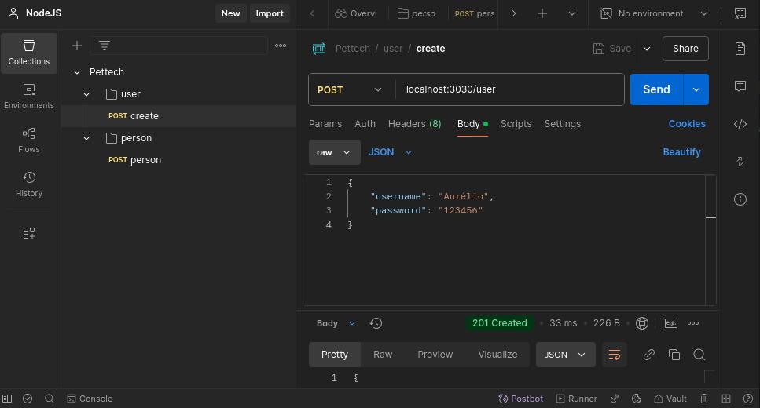  

Ao ser enviada, a requisição deverá retornar um status ```201```.  

**Observação:** Retornar a senha como está sendo feito é uma **grave falha de segurança**. Optou-se por essa prática para fins de simplificação em um projeto com finalidade pedagógica cujo escopo concentra-se na criação da API.  

## 30. Refatore o repositório de person:

Edite o arquivo de rota ```/src/repositories/person-repository.ts``` com o seguinte conteúdo:  

**Arquivo:** /src/repositories/person-repository.ts  
<details>
<summary>Ver conteúdo</summary>  

```
import { Person } from '@/entities/person.enetity'
import { database } from '@/lib/pg/db'

export class PersonRepository {
  async create({
    cpf,
    name,
    birth,
    email,
    user_id,
  }: Person): Promise<Person | undefined> {
    const result = await database.clientInstance?.query<Person>(
      `INSERT INTO "person" (cpf, name, birth, email, user_id) VALUES ($1, $2, $3, $4, $5) RETURNING *`,
      [cpf, name, birth, email, user_id],
    )

    return result?.rows[0]
  }
}
```  
</details>  

O ceontúdo do arquivo era um placeholder, conforme definido na [etapa em que ele foi criado](#18-crie-um-diretório-para-os-repositórios).  

## 31. Crie um use case para findWithPerson:

Quando foi [criado o repositório de user](#26-crie-a-entidade-user-seu-respositório-e-seu-use-case-de-criação), foi definido o método findWithPerson. Agora é preciso criar um use case para ele.  
Crie o arquivo ```/src/use-cases/find-with-person.ts``` com o seguinte conteúdo:  

**Arquivo:** /src/use-cases/find-with-person.ts  
<details>
<summary>Ver conteúdo</summary>  

```
import { Person } from '@/entities/person.enetity'
import { User } from '@/entities/user.entity'
import { UserRepository } from '@/repositories/user.repository'

export class FindWithPersonUseCase {
  constructor(private userRepository: UserRepository) {}

  handler(userId: number): Promise<(User & Person) | undefined> {
    return this.userRepository.findWithPerson(userId)
  }
}
```  
</details>  

## 32. Utilize o Postman para testar a criação de person:

Após executar o comando ```npm run start:dev```, crie no [Postman](https://www.postman.com/downloads/) uma requisição do tipo ```post``` para ```localhost:3030/person``` com o seguinte conteúdo no ```body```:  

<details>
<summary>Ver conteúdo</summary>  

```
{
    "cpf": "11122233344",
    "name": "Aurélio",
    "birth": "1985-01-01",
    "email": "email@email.com",
    "user_id": 1
}
```  
</details>  

A imagem a seguir mostra como ficará a requisição:  

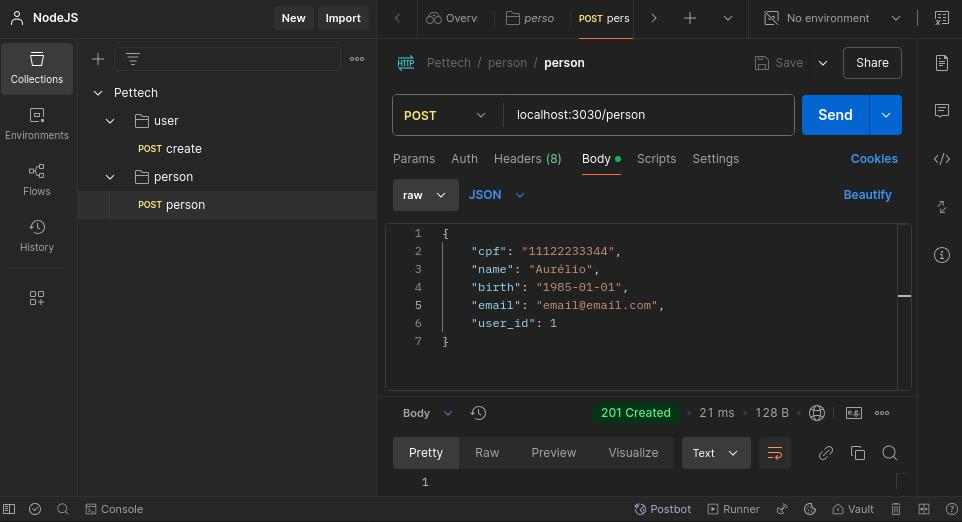  

Ao ser enviada, a requisição deverá retornar um status ```201```.  

Observando a tabela ```person``` no banco de dados é possível notar que a person criada não possui ```user_id```. Isso acontece porque mo controller ```/src/http/controllers/person/create.ts``` não está sendo atribuído valor para este campo. Edite o arquivo, deixando-o assim:  

**Arquivo:** /src/http/controllers/person/create.ts  
<details>
<summary>Ver conteúdo</summary>  

```
import { PersonRepository } from '@/repositories/person.repository'
import { CreatePersonUseCase } from '@/use-cases/create-person'
import { FastifyReply, FastifyRequest } from 'fastify'
import { z } from 'zod'

export async function create(request: FastifyRequest, reply: FastifyReply) {
  const registerBodySchema = z.object({
    cpf: z.string(),
    name: z.string(),
    birth: z.coerce.date(),
    email: z.string().email(),
    user_id: z.coerce.number(),
  })

  const { cpf, name, birth, email, user_id } = registerBodySchema.parse(
    request.body,
  )

  try {
    const personRepository = new PersonRepository()
    const createPersonUseCase = new CreatePersonUseCase(personRepository)

    const person = await createPersonUseCase.handler({
      cpf,
      name,
      birth,
      email,
      user_id,
    })

    return reply.status(201).send(person)
  } catch (error) {
    console.log(error)

    throw new Error('Internal server error')
  }
}
```  
</details>  

## 33. Crie e registre a controller para findWithPerson:

Crie o arquivo ```/src/http/controllers/user/find-user.ts``` com o seguinte conteúdo:  

**Arquivo:** /src/http/controllers/user/find-user.ts  
<details>
<summary>Ver conteúdo</summary>  

```
import { UserRepository } from '@/repositories/user.repository'
import { FindWithPersonUseCase } from '@/use-cases/find-with-person'
import { FastifyReply, FastifyRequest } from 'fastify'
import { z } from 'zod'

export async function findUser(request: FastifyRequest, reply: FastifyReply) {
  const registerParamsSchema = z.object({
    id: z.coerce.number(),
  })

  const { id } = registerParamsSchema.parse(request.params)

  try {
    const userRepository = new UserRepository()
    const findWithPersonUseCase = new FindWithPersonUseCase(userRepository)

    const user = await findWithPersonUseCase.handler(id)

    return reply.status(200).send(user)
  } catch (error) {
    console.log(error)

    throw new Error('Find user error')
  }
}
```  
</details>  

**Arquivo:** /src/http/controllers/user/routes.ts  
<details>
<summary>Ver conteúdo</summary>  

```
import { FastifyInstance } from 'fastify'
import { create } from './create'
import { findUser } from './find-user'

export async function userRoutes(app: FastifyInstance) {
  app.get('/user/:id', findUser)
  app.post('/user', create)
}
```  
</details>

## 34. Utilize o Postman para testar a busca por user:

Após executar o comando ```npm run start:dev```, crie no [Postman](https://www.postman.com/downloads/) uma requisição do tipo ```get``` para ```localhost:3030/user/1```.

A imagem a seguir mostra como ficará a requisição:  

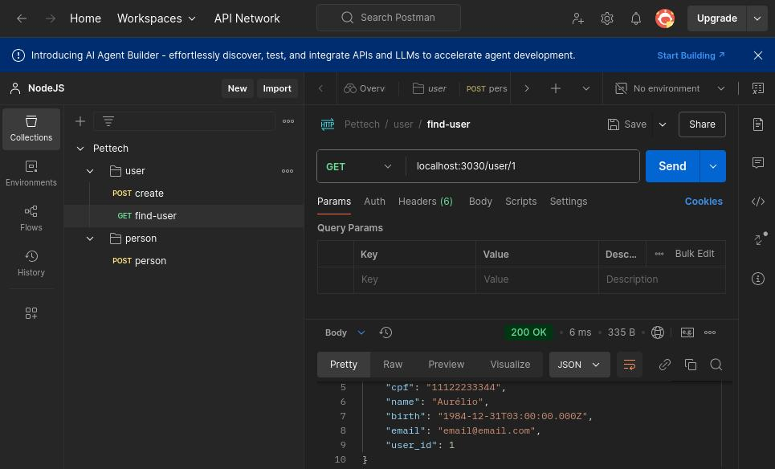  

Ao ser enviada, a requisição deverá retornar um status ```200```.  
Observe que, devido ao ```LEFT JOIN``` utilizado em ```/src/repositories/user.repository.ts``` no método ```findWithPerson``` o retorno fornece dados tanto da tabela ```user``` quanto da tabela ```person```.  

# Refatorando o projeto:

## 35. Crie o diretório factory:

As factories são usadas principalmente para centralizar a lógica de criação de objetos, tornando a aplicação mais modular e facilitando a manutenção.  

Crie o diretório ```src/use-cases/factory```.  
Em seguida, crie o arquivo ```src/use-cases/factory/make-create-user-use-case.ts``` com o seguinte conteúdo:  

**Arquivo:** src/use-cases/factory/make-create-user-use-case.ts  
<details>
<summary>Ver conteúdo</summary>  

```
import { UserRepository } from '@/repositories/user.repository'
import { CreateUserUseCase } from '../create-user'

export function makeCreateUserUseCase() {
  const userRepository = new UserRepository()
  const createUserUseCase = new CreateUserUseCase(userRepository)

  return createUserUseCase
}
```  
</details>  

Crie factories para os use cases ```create-person``` e ```find-with-person```:  

**Arquivo:** /src/use-cases/factory/make-create-person-use-case.ts  
<details>
<summary>Ver conteúdo</summary>  

```
import { PersonRepository } from '@/repositories/person.repository'
import { CreatePersonUseCase } from '../create-person'

export function makeCreatePersonUseCase() {
  const personRepository = new PersonRepository()
  const createPersonUseCase = new CreatePersonUseCase(personRepository)

  return createPersonUseCase
}
```  
</details>  

**Arquivo:** /src/use-cases/factory/make-find-with-person-use-case.ts  
<details>
<summary>Ver conteúdo</summary>  

```
import { UserRepository } from '@/repositories/user.repository'
import { FindWithPersonUseCase } from '../find-with-person'

export function makeFindWithPersonUseCase() {
  const userRepository = new UserRepository()
  const findWithPersonUseCase = new FindWithPersonUseCase(userRepository)

  return findWithPersonUseCase
}
```  
</details>  

## 36. Crie uma função para lidar com os erros da aplicação:

Edite o arquivo ```/src/app.ts``` deixando-o da seguinte forma:  

**Arquivo:** /src/app.ts  
<details>
<summary>Ver conteúdo</summary>  

```
import fastify from 'fastify'
import { personRoutes } from '@/http/controllers/person/routes'
import { userRoutes } from './http/controllers/user/routes'
import { ZodError } from 'zod'
import { env } from './env'

export const app = fastify()

app.register(personRoutes)
app.register(userRoutes)

app.setErrorHandler((error, _, reply) => {
  if (error instanceof ZodError) {
    return reply.status(400).send({
      message: 'Validation error',
      errors: error.format(),
    })
  }

  if (env.NODE_ENV === 'development') {
    console.error(error)
  }

  return reply.status(500).send({
    message: 'Internal server error',
  })
})
```  
</details>  

Erros do Zod são de requisições mal formuladas, por isso o status 400.  
Erros em ambiente de produção serão exibidos no console.  
Quaisquer erros que não sejam do Zod retornarão um status 500.  

## 37. Refatore as controllers:

Agora que foram criadas as factories, refatore as controlers.  

**Arquivo:** /src/http/controllers/person/create.ts  
<details>
<summary>Ver conteúdo</summary>  

```
import { makeCreatePersonUseCase } from '@/use-cases/factory/make-create-person-use-case'
import { FastifyReply, FastifyRequest } from 'fastify'
import { z } from 'zod'

export async function create(request: FastifyRequest, reply: FastifyReply) {
  const registerBodySchema = z.object({
    cpf: z.string(),
    name: z.string(),
    birth: z.coerce.date(),
    email: z.string().email(),
    user_id: z.coerce.number(),
  })

  const { cpf, name, birth, email, user_id } = registerBodySchema.parse(
    request.body,
  )

  const createPersonUseCase = makeCreatePersonUseCase()

  const person = await createPersonUseCase.handler({
    cpf,
    name,
    birth,
    email,
    user_id,
  })

  return reply.status(201).send(person)
}
```  
</details>  

**Arquivo:** /src/http/controllers/user/create.ts  
<details>
<summary>Ver conteúdo</summary>  

```
import { makeCreateUserUseCase } from '@/use-cases/factory/make-create-user-use-case'
import { FastifyReply, FastifyRequest } from 'fastify'
import { z } from 'zod'

export async function create(request: FastifyRequest, reply: FastifyReply) {
  const registerBodySchema = z.object({
    username: z.string(),
    password: z.string(),
  })

  const { username, password } = registerBodySchema.parse(request.body)

  const createUserUseCase = makeCreateUserUseCase()

  const user = await createUserUseCase.handler({ username, password })

  return reply.status(201).send(user)
}
```  
</details>  

**Arquivo:** /src/http/controllers/user/find-user.ts  
<details>
<summary>Ver conteúdo</summary>  

```
import { makeFindWithPersonUseCase } from '@/use-cases/factory/make-find-with-person-use-case'
import { FastifyReply, FastifyRequest } from 'fastify'
import { z } from 'zod'

export async function findUser(request: FastifyRequest, reply: FastifyReply) {
  const registerParamsSchema = z.object({
    id: z.coerce.number(),
  })

  const { id } = registerParamsSchema.parse(request.params)

  const findWithPersonUseCase = makeFindWithPersonUseCase()

  const user = await findWithPersonUseCase.handler(id)

  return reply.status(200).send(user)
}
```  
</details>

## 38. Crie o diretório de erros:

Crie o diretório ```/src/use-cases/errors```.  
Em seguida, crie o arquivo ```/src/use-cases/errors/resource-not-found-error.ts``` com o seguinte conteúdo:  

**Arquivo:** /src/use-cases/errors/resource-not-found-error.ts  
<details>
<summary>Ver conteúdo</summary>  

```
export class ResourceNotFoundError extends Error {
  constructor() {
    super('Resource not found')
  }
}
```  
</details>  

## 39. Utilize o erro criado no use case find-with-person:

Edite o arquivo ```/src/use-cases/find-with-person.ts``` deixando-o assim:

**Arquivo:** /src/use-cases/find-with-person.ts  
<details>
<summary>Ver conteúdo</summary>  

```
import { Person } from '@/entities/person.enetity'
import { User } from '@/entities/user.entity'
import { UserRepository } from '@/repositories/user.repository'
import { ResourceNotFoundError } from './errors/resource-not-found-error'

export class FindWithPersonUseCase {
  constructor(private userRepository: UserRepository) {}

  async handler(userId: number): Promise<(User & Person) | undefined> {
    const user = await this.userRepository.findWithPerson(userId)
    if (!user) {
      throw new ResourceNotFoundError()
    }
    return user
  }
}
```  
</details>  

Observe que o método ```handler``` pode retornar ```undefined```. Da forma como estava, a requisição era bem-sucedida mesmo quando o ```userId``` não existia. Agora, o erro criado será lançado.  

## 40. Inclua um caso para o erro ResourceNotFoundError em app.ts:

Edite o arquivo ```/src/app.ts``` deixando-o da seguinte forma:  

**Arquivo:** /src/app.ts  
<details>
<summary>Ver conteúdo</summary>  

```
import fastify from 'fastify'
import { personRoutes } from '@/http/controllers/person/routes'
import { userRoutes } from './http/controllers/user/routes'
import { ZodError } from 'zod'
import { env } from './env'
import { ResourceNotFoundError } from './use-cases/errors/resource-not-found-error'

export const app = fastify()

app.register(personRoutes)
app.register(userRoutes)

app.setErrorHandler((error, _, reply) => {
  if (error instanceof ZodError) {
    return reply.status(400).send({
      message: 'Validation error',
      errors: error.format(),
    })
  }

  if (env.NODE_ENV === 'development') {
    console.error(error)
  }

  if (error instanceof ResourceNotFoundError) {
    return reply.status(404).send({
      message: 'Resource not found',
    })
  }

  return reply.status(500).send({
    message: 'Internal server error',
  })
})
```  
</details>  

## 41. Refatore a forma como os erros são tratados:

Apesar de correta, a forma como está sendo feito o tratamento de erros não é ideal.  
Há um ```if``` para cada caso. Isso pode tornar o código verboso e dificultar sua manutenção.  

Comece criando o diretório ```/src/utils``` que abrigará funções utilitárias da aplicação.  
Em seguinda, crie o arquivo ```/src/utils/global-error-handler.ts``` com o seguinte conteúdo:  

**Arquivo:** /src/utils/global-error-handler.ts  
<details>
<summary>Ver conteúdo</summary>  

```
import { env } from '@/env'
import { FastifyReply, FastifyRequest } from 'fastify'
import { ZodError } from 'zod'

interface ErrorHandlerMap {
  [key: string]: (
    error: Error | ZodError,
    _: FastifyRequest,
    reply: FastifyReply,
  ) => void
}

export const errorHandlerMap: ErrorHandlerMap = {
  ZodError: (error, _, reply) => {
    return reply.status(400).send({
      message: 'Validation error',
      ...(error instanceof ZodError && { errors: error.format() }),
    })
  },
  ResourceNotFoundError: (error, __, reply) => {
    return reply.status(404).send({
      message: error.message,
    })
  },
}

export const globalErrorHandler = (
  error: Error,
  _: FastifyRequest,
  reply: FastifyReply,
) => {
  if (env.NODE_ENV === 'development') {
    console.error(error)
  }

  const handler = errorHandlerMap[error.constructor.name]

  if (handler) {
    return handler(error, _, reply)
  }

  return reply.status(500).send({
    message: 'Internal server error',
  })
}
```  
</details>  

**Importante:** Entenda o que foi feito. Na linha  
```const handler = errorHandlerMap[error.constructor.name]```  
observe que ```error.constructor.name``` é o nome do construtor do erro, podendo ser ```ZodError``` ou ```ResourceNotFoundError```.  
Quando um erro ocorre, seu tipo é identificado pelo nome do construtor e o manipulador correspondente é chamado a partir do ErrorHandlerMap.  
Para adicionar novos erros, basta acrescentar seu método de tratamento dentro de ```ErrorHandlerMap```.  

Agora remova o tratamento de erros de ```/src/app.ts```, deixando-o assim:

**Arquivo:** /src/app.ts  
<details>
<summary>Ver conteúdo</summary>  

```
import fastify from 'fastify'
import { personRoutes } from '@/http/controllers/person/routes'
import { userRoutes } from './http/controllers/user/routes'
import { globalErrorHandler } from './utils/global-error-handler'

export const app = fastify()

app.register(personRoutes)
app.register(userRoutes)

app.setErrorHandler(globalErrorHandler)
```  
</details>  

## 42. Crie uma interface para os repositórios:

Crie o repositório ```/src/repositories/pg```.  
Em seguida mova os aquivos ```/src/repositories/person.repository.ts``` e ```/src/repositories/user.repository.ts``` para dentro dele.  

**Atenção:** Mover arquivos irá causar erros de importação, então será necessário corrigir o caminho do arquivo movido dentro dos arquivos que o importam. Isso será feito posteriormente.  

Crie o arquivo ```/src/repositories/person.repository.interface.ts``` com o seguinte conteúdo:  

**Arquivo:** /src/repositories/person.repository.interface.ts  
<details>
<summary>Ver conteúdo</summary>  

```
import { Person } from '@/entities/person.enetity'

export interface IPersonRepository {
  create(person: Person): Promise<Person | undefined>
}
```  
</details>  

Crie o arquivo ```/src/repositories/user.repository.interface.ts``` com o seguinte conteúdo:  

**Arquivo:** /src/repositories/user.repository.interface.ts  
<details>
<summary>Ver conteúdo</summary>  

```
import { Person } from '@/entities/person.enetity'
import { User } from '@/entities/user.entity'

export interface IUserRepository {
  findWithPerson(userId: number): Promise<(User & Person) | undefined>
  create(user: User): Promise<User | undefined>
}
```  
</details>  

## 43. Implemente as interfaces nos repositórios:

Edite o arquivo ```/src/repositories/pg/person.repository.ts``` para implementar a interface criada:  

**Arquivo:** /src/repositories/pg/person.repository.ts  
<details>
<summary>Ver conteúdo</summary>  

```
import { Person } from '@/entities/person.enetity'
import { database } from '@/lib/pg/db'
import { IPersonRepository } from '../person.repository.interface'

export class PersonRepository implements IPersonRepository {
  async create({
    cpf,
    name,
    birth,
    email,
    user_id,
  }: Person): Promise<Person | undefined> {
    const result = await database.clientInstance?.query<Person>(
      `INSERT INTO "person" (cpf, name, birth, email, user_id) VALUES ($1, $2, $3, $4, $5) RETURNING *`,
      [cpf, name, birth, email, user_id],
    )

    return result?.rows[0]
  }
}
```  
</details>

Edite o arquivo ```/src/repositories/pg/user.repository.ts``` para implementar a interface criada:  

**Arquivo:** /src/repositories/pg/user.repository.ts  
<details>
<summary>Ver conteúdo</summary>  

```
import { Person } from '@/entities/person.enetity'
import { User } from '@/entities/user.entity'
import { database } from '@/lib/pg/db'
import { IUserRepository } from '../user.repository.interface'

export class UserRepository implements IUserRepository {
  public async create({ username, password }: User): Promise<User | undefined> {
    const result = await database.clientInstance?.query<User>(
      `INSERT INTO "user" (username, password) VALUES ($1, $2) RETURNING *`,
      [username, password],
    )

    return result?.rows[0]
  }

  public async findWithPerson(
    userId: number,
  ): Promise<(User & Person) | undefined> {
    const result = await database.clientInstance?.query(
      `SELECT * FROM "user" 
      LEFT JOIN "person" ON "user"."id" = "person"."user_id"
      WHERE "user"."id" = $1`,
      [userId],
    )

    return result?.rows[0]
  }
}
```  
</details>  

## 44. Altere as referências dos repositórios nos arquivos de use cases:

Edite o ```/src/use-cases/create-person.ts``` para injetar a interface como dependência, deixando-o assim:

**Arquivo:** /src/use-cases/create-person.ts  
<details>
<summary>Ver conteúdo</summary>  

```
import { Person } from '@/entities/person.enetity'
import { IPersonRepository } from '@/repositories/person.repository.interface'

export class CreatePersonUseCase {
  constructor(private personRepository: IPersonRepository) {}

  handler(person: Person) {
    return this.personRepository.create(person)
  }
}
```  
</details>  

Faça o mesmo com ```/src/use-cases/create-user.ts``` e ```/src/use-cases/find-with-person.ts```.  

**Arquivo:** /src/use-cases/create-user.ts  
<details>
<summary>Ver conteúdo</summary>  

```
import { User } from '@/entities/user.entity'
import { IUserRepository } from '@/repositories/user.repository.interface'

export class CreateUserUseCase {
  constructor(private userRepository: IUserRepository) {}

  async handler(user: User): Promise<User | undefined> {
    return await this.userRepository.create(user)
  }
}
```  
</details>  

**Arquivo:** /src/use-cases/find-with-person.ts  
<details>
<summary>Ver conteúdo</summary>  

```
import { Person } from '@/entities/person.enetity'
import { User } from '@/entities/user.entity'
import { ResourceNotFoundError } from './errors/resource-not-found-error'
import { IUserRepository } from '@/repositories/user.repository.interface'

export class FindWithPersonUseCase {
  constructor(private userRepository: IUserRepository) {}

  async handler(userId: number): Promise<(User & Person) | undefined> {
    const user = await this.userRepository.findWithPerson(userId)
    if (!user) {
      throw new ResourceNotFoundError()
    }
    return user
  }
}
```  
</details>  

## 45. Corrija as importações:

Quando [os arquivos dos repositórios foram movidos](#42-crie-uma-interface-para-os-repositórios) ocorreram erros previstos de importação. Assim, será necessário editar os arquivos a seguir, corrigindo as referências.

**Arquivo:** /src/use-cases/factory/make-create-person-use-case.ts  
<details>
<summary>Ver conteúdo</summary>  

```
import { PersonRepository } from '@/repositories/pg/person.repository'
import { CreatePersonUseCase } from '../create-person'

export function makeCreatePersonUseCase() {
  const personRepository = new PersonRepository()
  const createPersonUseCase = new CreatePersonUseCase(personRepository)

  return createPersonUseCase
}
```  
</details>  

**Arquivo:** /src/use-cases/factory/make-create-user-use-case.ts  
<details>
<summary>Ver conteúdo</summary>  

```
import { UserRepository } from '@/repositories/pg/user.repository'
import { CreateUserUseCase } from '../create-user'

export function makeCreateUserUseCase() {
  const userRepository = new UserRepository()
  const createUserUseCase = new CreateUserUseCase(userRepository)

  return createUserUseCase
}
```  
</details>  

**Arquivo:** /src/use-cases/factory/make-find-with-person-use-case.ts  
<details>
<summary>Ver conteúdo</summary>  

```
import { UserRepository } from '@/repositories/pg/user.repository'
import { FindWithPersonUseCase } from '../find-with-person'

export function makeFindWithPersonUseCase() {
  const userRepository = new UserRepository()
  const findWithPersonUseCase = new FindWithPersonUseCase(userRepository)

  return findWithPersonUseCase
}
```  
</details>  

## 46. Crie interfaces para as entidades:

Comece criando o diretório ```/src/entities/models/```.  

Prossiga criando arquivos para as interfaces das entidades:  

**Arquivo:** /src/entities/models/person.interface.ts  
<details>
<summary>Ver conteúdo</summary>  

```
export interface IPerson {
  id?: number
  cpf: string
  name: string
  birth: Date
  email: string
  user_id?: number
}
```  
</details>  

**Arquivo:** /src/entities/models/user.interface.ts  
<details>
<summary>Ver conteúdo</summary>  

```
export interface IUser {
  id?: number
  username: string
  password: string
}
```  
</details>  

Edite os arquivos das entidades para implementar as interfaces criadas.  

**Arquivo:** /src/entities/person.entity.ts  
<details>
<summary>Ver conteúdo</summary>  

```
import { IPerson } from '@/use-cases/find-address-by-person-id'

export class Person implements IPerson {
  id?: number
  cpf: string
  name: string
  birth: Date
  email: string
  user_id?: number

  constructor(cpf: string, name: string, birth: Date, email: string) {
    this.cpf = cpf
    this.name = name
    this.birth = birth
    this.email = email
  }
}
```  
</details>  

**Arquivo:** /src/entities/models/user.entity.ts  
<details>
<summary>Ver conteúdo</summary>  

```
import { IUser } from './models/user.interface'

export class User implements IUser {
  id?: number
  username: string
  password: string

  constructor(username: string, password: string) {
    this.username = username
    this.password = password
  }
}
```  
</details>  

Edite os arquivos das interfaces dos repositórios para que dependam das interfaces e não das implmentações:  

**Arquivo:** /src/repositories/person.repository.interface.ts  
<details>
<summary>Ver conteúdo</summary>  

```
import { IPerson } from '@/entities/models/person.interface'

export interface IPersonRepository {
  create(person: IPerson): Promise<IPerson | undefined>
}
```  
</details>  

**Arquivo:** /src/repositories/user.repository.interface.ts  
<details>
<summary>Ver conteúdo</summary>  

```
import { IPerson } from '@/entities/models/person.interface'
import { IUser } from '@/entities/models/user.interface'

export interface IUserRepository {
  findWithPerson(userId: number): Promise<(IUser & IPerson) | undefined>
  create(user: IUser): Promise<IUser | undefined>
}
```  
</details>  

Edite os arquivos dos repositórios para que dependam das interfaces e não das implmentações:  

**Arquivo:** /src/repositories/pg/person.repository.ts  
<details>
<summary>Ver conteúdo</summary>  

```
import { database } from '@/lib/pg/db'
import { IPersonRepository } from '../person.repository.interface'
import { IPerson } from '@/entities/models/person.interface'

export class PersonRepository implements IPersonRepository {
  async create({
    cpf,
    name,
    birth,
    email,
    user_id,
  }: IPerson): Promise<IPerson | undefined> {
    const result = await database.clientInstance?.query<IPerson>(
      `INSERT INTO "person" (cpf, name, birth, email, user_id) VALUES ($1, $2, $3, $4, $5) RETURNING *`,
      [cpf, name, birth, email, user_id],
    )

    return result?.rows[0]
  }
}
```  
</details>  

**Arquivo:** /src/repositories/pg/user.repository.ts  
<details>
<summary>Ver conteúdo</summary>  

```
import { database } from '@/lib/pg/db'
import { IUserRepository } from '../user.repository.interface'
import { IUser } from '@/entities/models/user.interface'
import { IPerson } from '@/entities/models/person.interface'

export class UserRepository implements IUserRepository {
  public async create({
    username,
    password,
  }: IUser): Promise<IUser | undefined> {
    const result = await database.clientInstance?.query<IUser>(
      `INSERT INTO "user" (username, password) VALUES ($1, $2) RETURNING *`,
      [username, password],
    )

    return result?.rows[0]
  }

  public async findWithPerson(
    userId: number,
  ): Promise<(IUser & IPerson) | undefined> {
    const result = await database.clientInstance?.query(
      `SELECT * FROM "user" 
      LEFT JOIN "person" ON "user"."id" = "person"."user_id"
      WHERE "user"."id" = $1`,
      [userId],
    )

    return result?.rows[0]
  }
}
```  
</details>  

Edite os arquivos de use cases para que dependam das interfaces e não das implementações:  

**Arquivo:** /src/use-cases/create-person.ts  
<details>
<summary>Ver conteúdo</summary>  

```
import { IPerson } from '@/entities/models/person.interface'
import { IPersonRepository } from '@/repositories/person.repository.interface'

export class CreatePersonUseCase {
  constructor(private personRepository: IPersonRepository) {}

  handler(person: IPerson) {
    return this.personRepository.create(person)
  }
}
```  
</details>  

**Arquivo:** /src/use-cases/create-user.ts  
<details>
<summary>Ver conteúdo</summary>  

```
import { IUser } from '@/entities/models/user.interface'
import { IUserRepository } from '@/repositories/user.repository.interface'

export class CreateUserUseCase {
  constructor(private userRepository: IUserRepository) {}

  async handler(user: IUser): Promise<IUser | undefined> {
    return await this.userRepository.create(user)
  }
}
```  
</details>  

**Arquivo:** /src/use-cases/find-with-person.ts  
<details>
<summary>Ver conteúdo</summary>  

```
import { ResourceNotFoundError } from './errors/resource-not-found-error'
import { IUserRepository } from '@/repositories/user.repository.interface'
import { IPerson } from '@/entities/models/person.interface'
import { IUser } from '@/entities/models/user.interface'

export class FindWithPersonUseCase {
  constructor(private userRepository: IUserRepository) {}

  async handler(userId: number): Promise<(IUser & IPerson) | undefined> {
    const user = await this.userRepository.findWithPerson(userId)
    if (!user) {
      throw new ResourceNotFoundError()
    }
    return user
  }
}
```  
</details>  

# Implementando novas funcionalidades:  


## 47. Crie o cadastro de address:

Crie o arquivo ```/src/entities/models/address.interface.ts``` com o seguinte conteúdo:    

**Arquivo:** /src/entities/models/address.interface.ts  
<details>
<summary>Ver conteúdo</summary>  

```
export interface IAddress {
  id?: number
  street: string
  city: string
  state: string
  zip_code: string
  person_id?: number
}
```  
</details>  

Em seguida, crie a entidade que implementa essa interface.  

Crie o arquivo ```/src/entities/address.entity.ts``` com o seguinte conteúdo:  

**Arquivo:** /src/entities/address.entity.ts  
<details>
<summary>Ver conteúdo</summary>  

```
import { IAddress } from './models/address.interface'

export class Address implements IAddress {
  id?: number
  street: string
  city: string
  state: string
  zip_code: string
  person_id?: number

  constructor(street: string, city: string, state: string, zip_code: string) {
    this.street = street
    this.city = city
    this.state = state
    this.zip_code = zip_code
  }
}
```  
</details>  

Prossiga criando a interface do repositório.  

Crie o arquivo ```/src/repositories/address.repository.interface.ts``` com o seguinte conteúdo:  

**Arquivo:** /src/repositories/address.repository.interface.ts  
<details>
<summary>Ver conteúdo</summary>  

```
import { IAddress } from '@/entities/models/address.interface'
import { IPerson } from '@/entities/models/person.interface'

export interface IAddressRepository {
  findAddressByPersonId(
    personId: number,
    page: number,
    limit: number,
  ): Promise<(IAddress & IPerson)[]>

  create(address: IAddress): Promise<IAddress | undefined>
}
```  
</details>  

Implemente a interface criando o arquivo ```src/repositories/pg/address.repository.ts``` com o seguinte conteúdo:  

**Arquivo:** /src/repositories/pg/address.repository.ts  
<details>
<summary>Ver conteúdo</summary>  

```
import { IAddress } from '@/entities/models/address.interface'
import { IAddressRepository } from '../address.repository.interface'
import { database } from '@/lib/pg/db'
import { IPerson } from '@/entities/models/person.interface'

export class AddressRepository implements IAddressRepository {
  async findAddressByPersonId(
    personId: number,
    page: number,
    limit: number,
  ): Promise<(IAddress & IPerson)[]> {
    const offset = (page - 1) * limit
    const query = `
    SELECT address.*, person.* 
    FROM address 
    JOIN person ON address.person_id = person.id 
    WHERE person.id = $1 LIMIT $2 OFFSET $3
    `
    const result = await database.clientInstance?.query<IAddress & IPerson>(
      query,
      [personId, limit, offset],
    )

    return result?.rows || []
  }

  async create({
    street,
    city,
    state,
    zip_code,
    person_id,
  }: IAddress): Promise<IAddress | undefined> {
    const result = await database.clientInstance?.query<IAddress>(
      `INSERT INTO "address" (street, city, state, zip_code, person_id) VALUES ($1, $2, $3, $4, $5) RETURNING *`,
      [street, city, state, zip_code, person_id],
    )

    return result?.rows[0]
  }
}
```  
</details>  

Prossiga com a criação dos use cases.  

Crie o arquivo ```/src/use-cases/create-address.ts``` com o seguinte conteúdo:  

**Arquivo:** /src/use-cases/create-address.ts  
<details>
<summary>Ver conteúdo</summary>  

```
import { IAddress } from '@/entities/models/address.interface'
import { IAddressRepository } from '@/repositories/address.repository.interface'

export class CreateAddressUseCase {
  constructor(private addressRepository: IAddressRepository) {}

  async handler(address: IAddress): Promise<IAddress | undefined> {
    return await this.addressRepository.create(address)
  }
}
```  
</details>  

Crie o arquivo ```/src/use-cases/find-address-by-person-id.ts``` com o seguinte conteúdo:  

**Arquivo:** /src/use-cases/find-address-by-person-id.ts  
<details>
<summary>Ver conteúdo</summary>  

```
import { IAddress } from '@/entities/models/address.interface'
import { IPerson } from '@/entities/models/person.interface'
import { IAddressRepository } from '@/repositories/address.repository.interface'

export class FindAddressByPersonId {
  constructor(private addressRepository: IAddressRepository) {}

  async handler(
    personId: number,
    page: number,
    limit: number,
  ): Promise<(IAddress & IPerson)[]> {
    return await this.addressRepository.findAddressByPersonId(
      personId,
      page,
      limit,
    )
  }
}
```  
</details>  

Finalize criando as factories.  

Crie o o arquivo ```/src/use-cases/factory/make-create-address-use-case.ts``` com o seguinte conteúdo:  

**Arquivo:** /src/use-cases/factory/make-create-address-use-case.ts  
<details>
<summary>Ver conteúdo</summary>  

```
import { AddressRepository } from '@/repositories/pg/address.repository'
import { CreateAddressUseCase } from '../create-address'

export function makeCreateAddressUseCase() {
  const addressRepository = new AddressRepository()

  const createAddressUseCase = new CreateAddressUseCase(addressRepository)

  return createAddressUseCase
}
```  
</details>  

Crie o o arquivo ```/src/use-cases/factory/make-find-address-by-person-id-use-case.ts``` com o seguinte conteúdo:  

**Arquivo:** /src/use-cases/factory/make-find-address-by-person-id-use-case.ts  
<details>
<summary>Ver conteúdo</summary>  

```
import { AddressRepository } from '@/repositories/pg/address.repository'
import { FindAddressByPersonId } from '../find-address-by-person-id'

export function makeFindAddressByPersonIdUseCase() {
  const addressRepository = new AddressRepository()

  const findAddressByPersonIdUseCase = new FindAddressByPersonId(
    addressRepository,
  )

  return findAddressByPersonIdUseCase
}
```  
</details>  

Crie o diretório ```/src/http/controllers/address```.  

Em seguida, crie o arquivo ```/src/http/controllers/address/create.ts``` com o seguinte conteúdo:  

**Arquivo:** /src/http/controllers/address/create.ts  
<details>
<summary>Ver conteúdo</summary>  

```
import { makeCreateAddressUseCase } from '@/use-cases/factory/make-create-address-use-case'
import { FastifyReply, FastifyRequest } from 'fastify'
import { z } from 'zod'

export async function create(request: FastifyRequest, reply: FastifyReply) {
  const regigsterBodySchema = z.object({
    street: z.string(),
    city: z.string(),
    state: z.string(),
    zip_code: z.string(),
    person_id: z.coerce.number(),
  })

  const { street, city, state, zip_code, person_id } =
    regigsterBodySchema.parse(request.body)
  const createAddressUseCase = makeCreateAddressUseCase()
  const address = await createAddressUseCase.handler({
    street,
    city,
    state,
    zip_code,
    person_id,
  })

  reply.status(201).send(address)
}
```  
</details>  

Crie o arquivo ```/src/http/controllers/address/find-address-by-person-id.ts``` com o seguinte conteúdo:  

**Arquivo:** /src/http/controllers/address/find-address-by-person-id.ts  
<details>
<summary>Ver conteúdo</summary>  

```
import { makeFindAddressByPersonIdUseCase } from '@/use-cases/factory/make-find-address-by-person-id-use-case'
import { FastifyReply, FastifyRequest } from 'fastify'
import { z } from 'zod'

export async function findAddressByPersonId(
  request: FastifyRequest,
  reply: FastifyReply,
) {
  const registerParamsSchema = z.object({
    person_id: z.coerce.number(),
  })

  const registerQuerySchema = z.object({
    page: z.coerce.number(),
    limit: z.coerce.number(),
  })

  const { person_id } = registerParamsSchema.parse(request.params)

  const { page, limit } = registerQuerySchema.parse(request.query)

  const findAddressByPersonIdUseCase = makeFindAddressByPersonIdUseCase()

  const address = await findAddressByPersonIdUseCase.handler(
    person_id,
    page,
    limit,
  )

  return reply.status(200).send(address)
}
```  
</details>  

Crie o arquivo ```/src/http/controllers/address/routes.ts```para registrar as rotas com o seguinte conteúdo:  

**Arquivo:** /src/http/controllers/address/routes.ts  
<details>
<summary>Ver conteúdo</summary>  

```
import { FastifyInstance } from 'fastify'
import { create } from './create'
import { findAddressByPersonId } from './find-address-by-person-id'

export async function addressRoutes(app: FastifyInstance) {
  app.post('/address', create)
  app.get('/address/person/:person_id', findAddressByPersonId)
}
```  
</details>  

Edite ```/src/app.ts``` importando o arquivo de rotas criado:

**Arquivo:** /src/app.ts  
<details>
<summary>Ver conteúdo</summary>  

```
import fastify from 'fastify'
import { personRoutes } from '@/http/controllers/person/routes'
import { userRoutes } from './http/controllers/user/routes'
import { globalErrorHandler } from './utils/global-error-handler'
import { addressRoutes } from './http/controllers/address/routes'

export const app = fastify()

app.register(personRoutes)
app.register(userRoutes)
app.register(addressRoutes)

app.setErrorHandler(globalErrorHandler)
```  
</details>  

## 48. Utilize o Postman para testar as rotas de address:

Após executar o comando ```npm run start:dev```, crie no [Postman](https://www.postman.com/downloads/) uma requisição do tipo ```post``` para ```localhost:3030/person``` com o seguinte conteúdo no ```body```:  

<details>
<summary>Ver conteúdo</summary>  

```
{    
  "street": "Rua",
  "city": "Cidade",
  "state": "SP",
  "zip_code": "12345678",
  "person_id": 2
}
```  

**Atenção:** Para descobrir um ```person_id``` válido você pode repetir os passos [dessa etapa](#34-utilize-o-postman-para-testar-a-busca-por-user) e verificar no retorno o campo ```id```.  

</details>

A imagem a seguir mostra como ficará a requisição:  

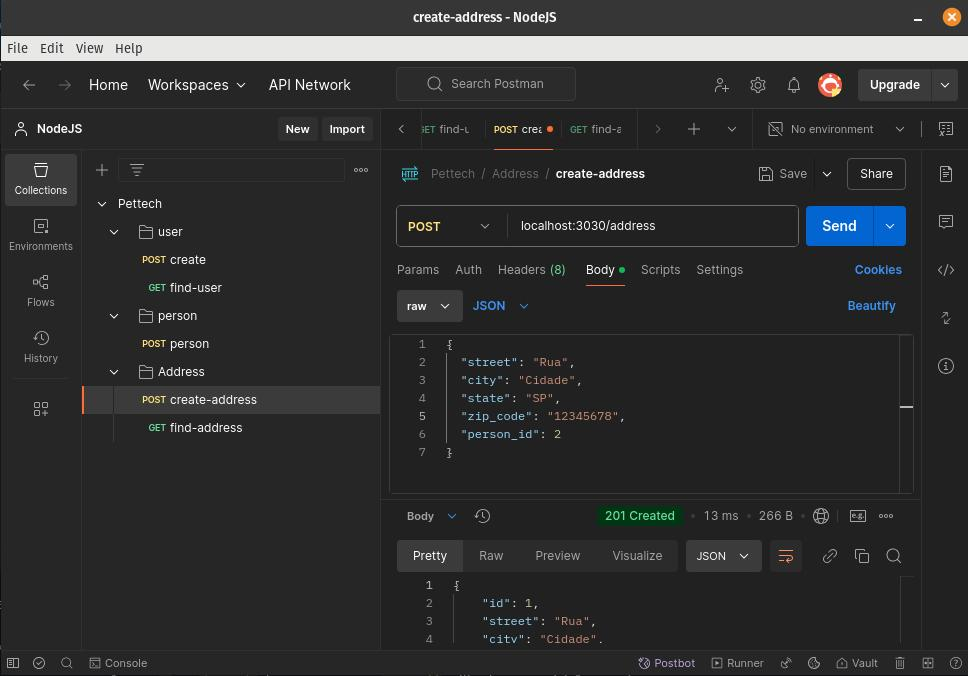  

Ao ser enviada, a requisição deverá retornar um status ```201```.  

Em seguida, crie outra requisição do tipo ```get``` para ```localhost:3030/address/person/2?page=1&limit=10```.  

**Atenção:** Observe uqe o pparâmetro ```2``` em ```/person/2``` deve ser o mesmo ```person_id``` utilizado na requisição anterior.  

A imagem a seguir mostra como ficará a requisição:  

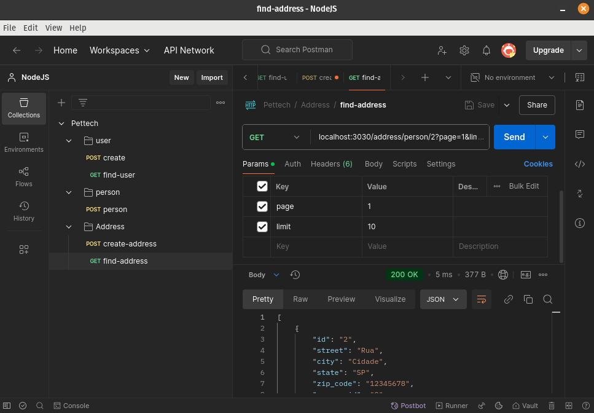  

Ao ser enviada, a requisição deverá retornar um status ```200```.  

# Implementação do TypeORM:

## 49. Instale as novas dependências:

Comece executando o coamndo se seguir no terminal, na raiz do projeto:  

```npm i typeorm reflect-metadata```  

Além de instalar o [TypeORM](https://typeorm.io/), será instalada a biblioteca [Reflect Metadata](https://www.npmjs.com/package/reflect-metadata).  

**Atenção:** Quando é feita a instalação do [TypeORM](https://typeorm.io/) em um projeto é preciso também instalar o driver de conexão com o banco de dados. No entanto, essa instalação já foi realizada em uma [etapa anterior](#25-conecte-a-aplicação-ao-banco-de-dados).

## 50. Configure o TypeORM:

Edite o arquivo ```/src/app.ts``` para importar o [Reflect Metadata](https://www.npmjs.com/package/reflect-metadata):

**Arquivo:** /src/app.ts  
<details>
<summary>Ver conteúdo</summary>  

```
import 'reflect-metadata'
import fastify from 'fastify'
import { personRoutes } from '@/http/controllers/person/routes'
import { userRoutes } from './http/controllers/user/routes'
import { globalErrorHandler } from './utils/global-error-handler'
import { addressRoutes } from './http/controllers/address/routes'

export const app = fastify()

app.register(personRoutes)
app.register(userRoutes)
app.register(addressRoutes)

app.setErrorHandler(globalErrorHandler)
```  
</details>  

Edite o arquivo ```/tsconfig.json``` para habilitar novas flags:

**Arquivo:** /tsconfig.json  
<details>
<summary>Ver conteúdo</summary>  

```
...  

"experimentalDecorators": true,  
"emitDecoratorMetadata": true,  

...  

"strictPropertyInitialization": false,
...  
```  
</details>  

Crie o diretório ```/src/lib/typeorm```.  

Crie o arquivo ```/src/lib/typeorm/typeorm.ts``` que será responsável pela conexão da aplicação com o banco de dados:  

**Arquivo:** /src/lib/typeorm/typeorm.ts  
<details>
<summary>Ver conteúdo</summary>  

```
import { DataSource } from 'typeorm'

import { env } from '@/env'

export const appDataSource = new DataSource({
  type: 'postgres',
  host: env.DATABASE_HOST,
  port: env.DATABASE_PORT,
  username: env.DATABASE_USER,
  password: env.DATABASE_PASSWORD,
  database: env.DATABASE_NAME,
  entities: [],
  logging: env.NODE_ENV === 'development',
})

appDataSource
  .initialize()
  .then(() => {
    console.log('Database with TypeORM connected!')
  })
  .catch((err) => {
    console.error('Error connecting to the database with TypeORM', err)
  })
```  
</details>  

Edite o arquivo ```/src/app.ts``` para importar o arquivo ```/src/lib/typeorm/typeorm.ts``` de conexão com o banco de dados:

**Arquivo:** /src/app.ts  
<details>
<summary>Ver conteúdo</summary>  

```
import 'reflect-metadata'
import '@/lib/typeorm/typeorm'
import fastify from 'fastify'
import { personRoutes } from '@/http/controllers/person/routes'
import { userRoutes } from './http/controllers/user/routes'
import { globalErrorHandler } from './utils/global-error-handler'
import { addressRoutes } from './http/controllers/address/routes'

export const app = fastify()

app.register(personRoutes)
app.register(userRoutes)
app.register(addressRoutes)

app.setErrorHandler(globalErrorHandler)
```  
</details>  

Teste a conexão com o banco executando o comando a seguir no terminal na raiz do projeto:  

```npm run start:dev```  

A mensagem ```Database with TypeORM connected!``` deverá ser exibida no console em caso de sucesso.  

## 51. Crie uma nova entidade para product:

Crie o arquivo ```/src/entities/models/product.interface.ts``` para definir a interface da entidade product:

**Arquivo:** /src/entities/models/product.interface.ts  
<details>
<summary>Ver conteúdo</summary>  

```
export interface IProduct {
  id?: string
  name: string
  description: string
  image_url: string
  price: number
}
```  
</details>  

**Importante:** o campo ```id``` é do tipo ```string``` porque será utilizado um [uuid](https://pt.wikipedia.org/wiki/Identificador_%C3%BAnico_universal) em vez de um valor autoincremental. Essa prática é útil no desenvolvimento de APIs públicas, uma vez que dificulta o envio malicioso de requisições, já que os ids não são autoincrementais. Ou seja, conhecido o valor de um id não é possível determinar o próximo.  

Crie o arquivo ```/src/entities/product.entity.ts``` para implementar a interface da entidade product:  

**Arquivo:** /src/entities/product.entity.ts  
<details>
<summary>Ver conteúdo</summary>  

```
import { Column, Entity, PrimaryGeneratedColumn } from 'typeorm'
import { IProduct } from './models/product.interface'

@Entity({
  name: 'product',
})
export class Product implements IProduct {
  @PrimaryGeneratedColumn('uuid', {
    name: 'id',
  })
  id?: string | undefined

  @Column({
    name: 'name',
    type: 'varchar',
  })
  name: string

  @Column({
    name: 'description',
    type: 'text',
  })
  description: string

  @Column({
    name: 'image_url',
    type: 'varchar',
  })
  image_url: string

  @Column({
    name: 'price',
    type: 'double precision',
  })
  price: number
}
```  
</details>  

Observe que esta entidade foi estruturada de forma diferente das outras. Isso se deve à utilização do [TypeORM](https://typeorm.io/). A seguir estão algumas breves explicações:  
**@Entity** tem como valor da chave ```name``` o nome da tabela do banco de dados a qual essa entidade se refere.  
**@PrimaryGeneratedColumn** e **@Column** são anotações. Todas as propriedades devem ser precedidas de anotações.  

Edite o arquivo ```/src/lib/typeorm/typeorm.ts``` de configuração do [TypeORM](https://typeorm.io/) para mapear a entidade criada:  

**Arquivo:** /src/lib/typeorm/typeorm.ts  
<details>
<summary>Ver conteúdo</summary>  

```
import { DataSource } from 'typeorm'

import { env } from '@/env'
import { Product } from '@/entities/product.entity'

export const appDataSource = new DataSource({
  type: 'postgres',
  host: env.DATABASE_HOST,
  port: env.DATABASE_PORT,
  username: env.DATABASE_USER,
  password: env.DATABASE_PASSWORD,
  database: env.DATABASE_NAME,
  entities: [Product],
  logging: env.NODE_ENV === 'development',
})

appDataSource
  .initialize()
  .then(() => {
    console.log('Database with TypeORM connected!')
  })
  .catch((err) => {
    console.error('Error connecting to the database with TypeORM', err)
  })
```  
</details>  

## 52. Crie uma nova entidade para category:

Crie o arquivo ```/src/entities/models/category.interdace.ts``` para definir a interface da entidade category:

**Arquivo:** /src/entities/models/category.interdace.ts  
<details>
<summary>Ver conteúdo</summary>  

```
export interface ICategory {
  id?: number
  name: string
  createdAt?: Date
}
```  
</details>  

Crie o arquivo ```/src/entities/category.entity.ts``` para implementar a interface da entidade category:  

**Arquivo:** /src/entities/category.entity.ts  
<details>
<summary>Ver conteúdo</summary>  

```
import { Column, Entity, PrimaryGeneratedColumn } from 'typeorm'
import { ICategory } from './models/category.interface'

@Entity({
  name: 'category',
})
export class Category implements ICategory {
  @PrimaryGeneratedColumn('increment', {
    name: 'id',
  })
  id?: number

  @Column({
    name: 'name',
    type: 'varchar',
  })
  name: string

  @Column({
    name: 'creation_date',
    type: 'timestamp without time zone',
    default: () => 'CURRENT_TIMESTAMP',
  })
  createdAt: Date
}
```  
</details>  

Edite o arquivo ```/src/lib/typeorm/typeorm.ts``` de configuração do [TypeORM](https://typeorm.io/) para mapear a entidade criada:  

**Arquivo:** /src/lib/typeorm/typeorm.ts  
<details>
<summary>Ver conteúdo</summary>  

```
import { DataSource } from 'typeorm'

import { env } from '@/env'
import { Product } from '@/entities/product.entity'
import { Category } from '@/entities/category.entity'

export const appDataSource = new DataSource({
  type: 'postgres',
  host: env.DATABASE_HOST,
  port: env.DATABASE_PORT,
  username: env.DATABASE_USER,
  password: env.DATABASE_PASSWORD,
  database: env.DATABASE_NAME,
  entities: [Product, Category],
  logging: env.NODE_ENV === 'development',
})

appDataSource
  .initialize()
  .then(() => {
    console.log('Database with TypeORM connected!')
  })
  .catch((err) => {
    console.error('Error connecting to the database with TypeORM', err)
  })
```  
</details>  

## 53. Crie o relacionamento entre as entidades product e category:

Edite o arquivo ```src/entities/models/product.interface.ts``` e adicione o campo ```categories```:  

**Arquivo:** /src/entities/models/product.interface.ts  
<details>
<summary>Ver conteúdo</summary>  

```
import { ICategory } from './category.interface'

export interface IProduct {
  id?: string
  name: string
  description: string
  image_url: string
  price: number
  categories?: ICategory[]
}
```  
</details>  

Implemente ```categories``` em ```/src/entities/product.entity.ts```:  

**Arquivo:** /src/entities/product.entity.ts  
<details>
<summary>Ver conteúdo</summary>  

```
import {
  Column,
  Entity,
  JoinTable,
  ManyToMany,
  PrimaryGeneratedColumn,
} from 'typeorm'
import { IProduct } from './models/product.interface'
import { ICategory } from './models/category.interface'
import { Category } from './category.entity'

@Entity({
  name: 'product',
})
export class Product implements IProduct {
  @PrimaryGeneratedColumn('uuid', {
    name: 'id',
  })
  id?: string | undefined

  @Column({
    name: 'name',
    type: 'varchar',
  })
  name: string

  @Column({
    name: 'description',
    type: 'text',
  })
  description: string

  @Column({
    name: 'image_url',
    type: 'varchar',
  })
  image_url: string

  @Column({
    name: 'price',
    type: 'double precision',
  })
  price: number

  @ManyToMany(() => Category, {
    cascade: true,
  })
  @JoinTable({
    name: 'product_category',
    joinColumn: {
      name: 'product_id',
      referencedColumnName: 'id',
    },
    inverseJoinColumn: {
      name: 'category_id',
      referencedColumnName: 'id',
    },
  })
  categories?: ICategory[] | undefined
}
```  
</details>  

As entidades ```product``` e ```category``` possuem um relacionamento do tipo [muitos-para-muitos](https://pt.wikipedia.org/wiki/Muitos-para-muitos). Ou seja, um product pode se relacionar com várias categories e vice-versa. A tabela ```product_category``` é usada para relacionar as tabelas ```product``` e ```category```.  

## 54. Crie repositórios para as novas entidades:

Crie as interfaces dos repositórios:  

**Arquivo:** /src/repositories/product.repository.interface.ts  
<details>
<summary>Ver conteúdo</summary>  

```
import { IProduct } from '@/entities/models/product.interface'

export interface IProductRepository {
  create(product: IProduct): Promise<IProduct>
}
```  
</details>  

**Arquivo:** /src/repositories/category.repository.interface.ts  
<details>
<summary>Ver conteúdo</summary>  

```
import { IProduct } from '@/entities/models/product.interface'

export interface ICategoryRepository {
  create(name: string, products?: IProduct[]): Promise<void>
}
```  
</details>  

Crie o diretório ```/src/repositories/typeorm``` para armazenar as implementações das interfaces dos repositórios.  

Em seguida, implemente essas interfaces:  

**Arquivo:** /src/repositories/typeorm/product.repository.ts  
<details>
<summary>Ver conteúdo</summary>  

```
import { IProduct } from '@/entities/models/product.interface'
import { IProductRepository } from '../product.repository.interface'
import { Product } from '@/entities/product.entity'
import { Repository } from 'typeorm'
import { appDataSource } from '@/lib/typeorm/typeorm'

export class ProductRepository implements IProductRepository {
  private repository: Repository<Product>

  constructor() {
    this.repository = appDataSource.getRepository(Product)
  }

  create(product: IProduct): Promise<IProduct> {
    return this.repository.save(product)
  }
}
```  
</details>  

**Arquivo:** /src/repositories/typeorm/category.repository.ts  
<details>
<summary>Ver conteúdo</summary>  

```
import { Repository } from 'typeorm'
import { ICategoryRepository } from '../category.repository.interface'
import { Category } from '@/entities/category.entity'
import { appDataSource } from '@/lib/typeorm/typeorm'

export class CategoryRepository implements ICategoryRepository {
  private repository: Repository<Category>

  constructor() {
    this.repository = appDataSource.getRepository(Category)
  }

  async create(name: string): Promise<void> {
    await this.repository.save({ name })
  }
}
```  
</details>  

Observe que o método ```create()``` de ```CategoryRepository``` não recebe o parâmetro opcional ```products``` como definido na sua interface ```ICategoryRepository```. Essa funcionalidade será implementada posteriormente.  

## 55. Crie as novas use cases:

Crie arquivos para os métodos dos respositórios criados:  

**Arquivo:** /src/use-cases/create-product.ts  
<details>
<summary>Ver conteúdo</summary>  

```
import { IProduct } from '@/entities/models/product.interface'
import { IProductRepository } from '@/repositories/product.repository.interface'

export class CreateProductUseCase {
  constructor(private productRepository: IProductRepository) {}

  async handler(product: IProduct) {
    this.productRepository.create(product)
  }
}
```  
</details>  

**Arquivo:** /src/use-cases/create-category.ts  
<details>
<summary>Ver conteúdo</summary>  

```
import { ICategoryRepository } from '@/repositories/category.repository.interface'

export class CreateCategoryUseCase {
  constructor(private categoryRepository: ICategoryRepository) {}

  async handler(name: string): Promise<void> {
    return await this.categoryRepository.create(name)
  }
}
```  
</details>  

## 56. Crie as novas factories:

Crie factories para as novas use-cases:  

**Arquivo:** /src/use-cases/factory/make-create-product-use-case.ts  
<details>
<summary>Ver conteúdo</summary>  

```
import { ProductRepository } from '@/repositories/typeorm/product.repository'
import { CreateProductUseCase } from '../create.product'

export function makeCreateProductUseCase() {
  const productRepository = new ProductRepository()
  const createProductUseCase = new CreateProductUseCase(productRepository)

  return createProductUseCase
}
```  
</details>  

**Arquivo:** /src/use-cases/factory/make-create-category-use-case.ts  
<details>
<summary>Ver conteúdo</summary>  

```
import { CategoryRepository } from '@/repositories/typeorm/category.repository'
import { CreateCategoryUseCase } from '../create-category'

export function makeCreateCategoryUseCase() {
  const categoryRepository = new CategoryRepository()

  const createCategoryUseCase = new CreateCategoryUseCase(categoryRepository)

  return createCategoryUseCase
}
```  
</details>  

## 57. Crie novas controllers:

As use cases criadas precisam de novas controllers para serem executas.  

Crie os diretórios ```/src/http/controllers/product``` e ```/src/http/controllers/category```.  

Em seguida crie os arquivos das controllers:  

**Arquivo:** /src/http/controllers/product/create.ts  
<details>
<summary>Ver conteúdo</summary>  

```
import { makeCreateProductUseCase } from '@/use-cases/factory/make-create-product-use-case'
import { FastifyReply, FastifyRequest } from 'fastify'
import { z } from 'zod'

export async function create(request: FastifyRequest, reply: FastifyReply) {
  const registerBodySchema = z.object({
    name: z.string(),
    description: z.string(),
    image_url: z.string(),
    price: z.coerce.number(),
    categories: z
      .array(
        z.object({
          id: z.coerce.number().optional(),
          name: z.string(),
        }),
      )
      .optional(),
  })

  const { name, description, image_url, price, categories } =
    registerBodySchema.parse(request.body)

  const createProductUseCase = makeCreateProductUseCase()

  const product = await createProductUseCase.handler({
    name,
    description,
    image_url,
    price,
    categories,
  })

  return reply.status(201).send(product)
}
```  
</details>  

**Arquivo:** /src/http/controllers/category/create.ts  
<details>
<summary>Ver conteúdo</summary>  

```
import { makeCreateCategoryUseCase } from '@/use-cases/factory/make-create-category-use-case'
import { FastifyReply, FastifyRequest } from 'fastify'
import { z } from 'zod'

export async function create(request: FastifyRequest, reply: FastifyReply) {
  const registerBodySchema = z.object({
    name: z.string(),
  })

  const { name } = registerBodySchema.parse(request.body)

  const createCategoryUseCase = makeCreateCategoryUseCase()

  await createCategoryUseCase.handler(name)

  return reply.status(201).send()
}
```  
</details>  

## 57. Crie novas rotas para as controllers:

Crie rotas para as novas controllers criadas:  

**Arquivo:** /src/http/controllers/product/routes.ts  
<details>
<summary>Ver conteúdo</summary>  

```
import { FastifyInstance } from 'fastify'
import { create } from './create'

export async function productRoutes(app: FastifyInstance) {
  app.post('/product', create)
}
```  
</details>  

**Arquivo:** /src/http/controllers/category/routes.ts  
<details>
<summary>Ver conteúdo</summary>  

```
import { FastifyInstance } from 'fastify'
import { create } from './create'

export async function categoryRoutes(app: FastifyInstance) {
  app.post('/category', create)
}
```  
</details>  

## 58. Registre as rotas criadas:

Edite o arquivo ```/src/app.ts``` importando as rotas criadas:  

**Arquivo:** /src/app.ts  
<details>
<summary>Ver conteúdo</summary>  

```
import 'reflect-metadata'
import '@/lib/typeorm/typeorm'
import fastify from 'fastify'
import { personRoutes } from '@/http/controllers/person/routes'
import { userRoutes } from './http/controllers/user/routes'
import { globalErrorHandler } from './utils/global-error-handler'
import { addressRoutes } from './http/controllers/address/routes'
import { productRoutes } from './http/controllers/product/routes'
import { categoryRoutes } from './http/controllers/category/routes'

export const app = fastify()

app.register(personRoutes)
app.register(userRoutes)
app.register(addressRoutes)
app.register(productRoutes)
app.register(categoryRoutes)

app.setErrorHandler(globalErrorHandler)
```  
</details>  

## 59. Teste as rotas criadas:

Após executar o comando ```npm run start:dev```, crie no [Postman](https://www.postman.com/downloads/) uma requisição do tipo ```post``` para ```localhost:3030/product``` com o seguinte conteúdo no ```body```:  

<details>
<summary>Ver conteúdo</summary>  

```
{
    "name": "Bolinha",
    "description": "Bolinha para pets",
    "image_url": "https://url.com.br/imagem",
    "price": 49.90
}
```  
</details>  

A imagem a seguir mostra como ficará a requisição:  

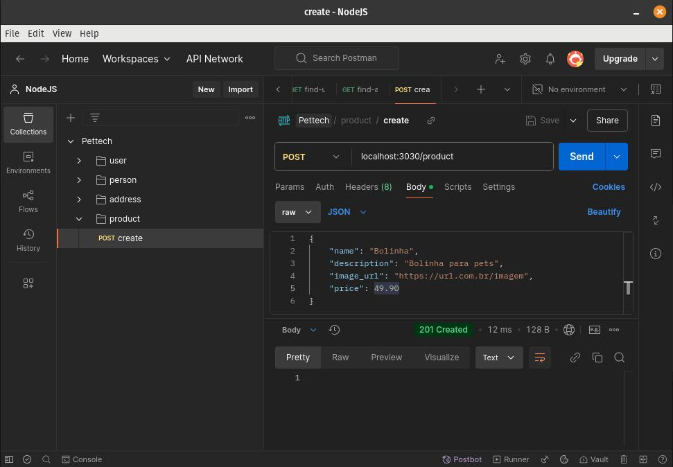  

Um erro é esperado ao enviar essa requisição. Ele será tratado na [próxima etapa](#60-corrija-o-banco).  

Após executar o comando ```npm run start:dev```, crie no [Postman](https://www.postman.com/downloads/) uma requisição do tipo ```post``` para ```localhost:3030/category``` com o seguinte conteúdo no ```body```:  

<details>
<summary>Ver conteúdo</summary>  

```
{
    "name": "Brinquedo"
}
```  
</details>  

A imagem a seguir mostra como ficará a requisição:  

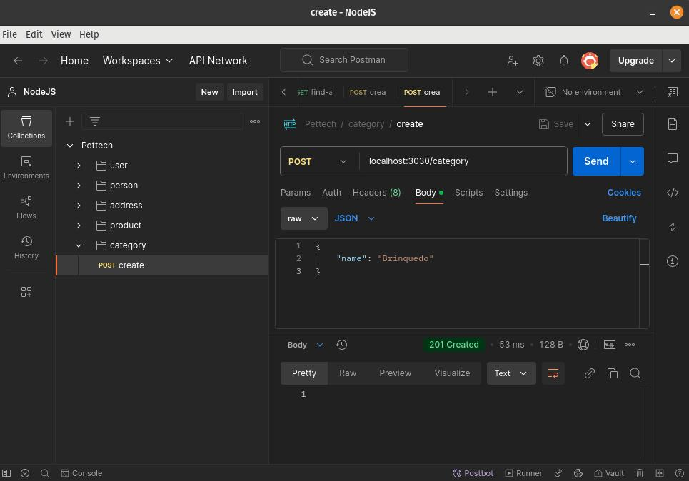  

Ao ser enviada, a requisição deverá retornar um status ```201```.  

## 60. Corrija o banco:

Ao enviar a requisição do tipo ```post``` para ```localhost:3030/product``` ocorreu um erro com a seguinte mensagem no console:  

```QueryFailedError: null value in column "id" of relation "product" violates not-null constraint```

Isso aconteceu, porque no script de criação do banco há o comando:  

<details>
<summary>Ver conteúdo</summary>  

```
CREATE TABLE product (
id UUID PRIMARY KEY,
name VARCHAR(255) NOT NULL,
description TEXT,
image_url VARCHAR(255),
price DOUBLE PRECISION
);
```  
</details>

Nele é possível notar que ```id``` é uma chave primária, porém não é gerada automaticamente. Dessa forma, ocorreu um erro quando foi enviada uma requisição sem ```id```.  

Para modificar a estrutura do banco de dados será realizada uma [migration com TypeORM](https://orkhan.gitbook.io/typeorm/docs/migrations).  

Execute o seguinte comando no terminal na raiz do projeto:  

```npx typeorm migration:create ./src/lib/typeorm/migrations/ProductAutoGenerateUUID```  

**Importante:** Observe que foi criado um arquivo a migration em ```/src/lib/typeorm/migrations```.  A sequência numérica no início do nome da migration é um [timestamp](https://pt.wikipedia.org/wiki/Marca_temporal), então o seu será diferente do que será usado como exemplo.  

Edite o arquivo da migration ```src/lib/typeorm/migrations/1738694121784-ProductAutoGenerateUUID.ts```:  

**Arquivo:** /ssrc/lib/typeorm/migrations/1738694121784-ProductAutoGenerateUUID.ts  
<details>
<summary>Ver conteúdo</summary>  

```
import { MigrationInterface, QueryRunner } from 'typeorm'

export class ProductAutoGenerateUUID1738694121784
  implements MigrationInterface
{
  public async up(queryRunner: QueryRunner): Promise<void> {
    await queryRunner.query(`
        CREATE EXTENSION IF NOT EXISTS "uuid-ossp";
    `)

    await queryRunner.query(`
        ALTER TABLE "product" 
        ALTER COLUMN "id" SET DEFAULT uuid_generate_v4();
    `)
  }

  public async down(queryRunner: QueryRunner): Promise<void> {
    await queryRunner.query(`
        ALTER TABLE "product" 
        ALTER COLUMN "id" DROP DEFAULT;
    `)
  }
}
```  
</details>

**Importante:** O método ```up()``` é usado para realizar a alteração desejada no banco. O método ```down()``` é responsável por desfazê-la, caso haja necessidade.  

Edite o arquivo ```/src/lib/typeorm/typeorm.ts``` para importar a migration criada:  

**Arquivo:** /src/lib/typeorm/typeorm.ts  
<details>
<summary>Ver conteúdo</summary>  

```
import { DataSource } from 'typeorm'

import { env } from '@/env'
import { Product } from '@/entities/product.entity'
import { Category } from '@/entities/category.entity'
import { ProductAutoGenerateUUID1738694121784 } from './migrations/1738694121784-ProductAutoGenerateUUID'

export const appDataSource = new DataSource({
  type: 'postgres',
  host: env.DATABASE_HOST,
  port: env.DATABASE_PORT,
  username: env.DATABASE_USER,
  password: env.DATABASE_PASSWORD,
  database: env.DATABASE_NAME,
  entities: [Product, Category],
  migrations: [ProductAutoGenerateUUID1738694121784],
  logging: env.NODE_ENV === 'development',
})

appDataSource
  .initialize()
  .then(() => {
    console.log('Database with TypeORM connected!')
  })
  .catch((err) => {
    console.error('Error connecting to the database with TypeORM', err)
  })
```  
</details>  

Lembre-se que o nome ```ProductAutoGenerateUUID1738694121784``` será diferente, então importe o nome da classe gerada na criação da migration.  

É preciso transpilar a migration de TypeScript para JavaScript e em seguida executá-la.  

Para isso, execute o comando a seguir no terminal na raiz do projeto:  

 ```npm run build && npx typeorm migration:run -d ./build/lib/typeorm/typeorm.js```  

 Execute os passos da etapa anterior para verificar que a requisição do tipo ```post``` para ```localhost:3030/product``` será registrada corretamente no banco de dados.  

## 61. Implemente novos métodos para product:

Edite o arquivo ```/src/repositories/product.repository.interface.ts``` de interface do repositório, criando as assinaturas dos novos métodos:  

**Arquivo:** /src/repositories/product.repository.interface.ts  
<details>
<summary>Ver conteúdo</summary>  

```
import { IProduct } from '@/entities/models/product.interface'

export interface IProductRepository {
  findAll(page: number, limit: number): Promise<IProduct[]>
  findById(id: string): Promise<IProduct | null>
  create(product: IProduct): Promise<IProduct>
  update(product: IProduct): Promise<IProduct>
  delete(id: string): Promise<void>
}
```  
</details>  

Implemente os novos métodos em ```/src/repositories/typeorm/product.repository.ts```:  

**Arquivo:** /src/repositories/typeorm/product.repository.ts  
<details>
<summary>Ver conteúdo</summary>  

```
import { IProduct } from '@/entities/models/product.interface'
import { IProductRepository } from '../product.repository.interface'
import { Product } from '@/entities/product.entity'
import { Repository } from 'typeorm'
import { appDataSource } from '@/lib/typeorm/typeorm'

export class ProductRepository implements IProductRepository {
  private repository: Repository<Product>

  constructor() {
    this.repository = appDataSource.getRepository(Product)
  }

  async findAll(page: number, limit: number): Promise<IProduct[]> {
    return this.repository.find({
      relations: ['categories'],
      skip: (page - 1) * limit,
      take: limit,
    })
  }

  async findById(id: string): Promise<IProduct | null> {
    return this.repository.findOne({
      relations: ['categories'],
      where: { id },
    })
  }

  async create(product: IProduct): Promise<IProduct> {
    return this.repository.save(product)
  }

  async update(product: IProduct): Promise<IProduct> {
    return this.repository.save(product)
  }

  async delete(id: string): Promise<void> {
    await this.repository.delete(id)
  }
}
```  
</details>  

Crie uma use case para cada novo método:  

**Arquivo:** /src/use-cases/find-all-products.ts  
<details>
<summary>Ver conteúdo</summary>  

```
import { IProduct } from '@/entities/models/product.interface'
import { IProductRepository } from '@/repositories/product.repository.interface'

export class FindAllProductsUseCase {
  constructor(private productRepository: IProductRepository) {}

  async handler(page: number, limit: number): Promise<IProduct[]> {
    return this.productRepository.findAll(page, limit)
  }
}
```  
</details>  

**Arquivo:** /src/use-cases/find-product.ts  
<details>
<summary>Ver conteúdo</summary>  

```
import { IProductRepository } from '@/repositories/product.repository.interface'
import { ResourceNotFoundError } from './errors/resource-not-found-error'
import { IProduct } from '@/entities/models/product.interface'

export class FindProductUseCase {
  constructor(private productRepository: IProductRepository) {}

  async handler(id: string): Promise<IProduct | null> {
    const product = this.productRepository.findById(id)

    if (!product) {
      throw new ResourceNotFoundError()
    }

    return product
  }
}
```  
</details>  

**Arquivo:** /src/use-cases/update-product.ts  
<details>
<summary>Ver conteúdo</summary>  

```
import { IProduct } from '@/entities/models/product.interface'
import { IProductRepository } from '@/repositories/product.repository.interface'

export class UpdateProductUseCase {
  constructor(private productRepository: IProductRepository) {}

  async handler(product: IProduct): Promise<IProduct> {
    return this.productRepository.update(product)
  }
}
```  
</details>  

**Arquivo:** /src/use-cases/delete-product.ts  
<details>
<summary>Ver conteúdo</summary>  

```
import { IProductRepository } from '@/repositories/product.repository.interface'

export class DeleteProductUseCase {
  constructor(private productRepository: IProductRepository) {}

  handler(id: string): Promise<void> {
    return this.productRepository.delete(id)
  }
}
```  
</details>  

Crie uma factory para cada novo use case:  

**Arquivo:** /src/use-cases/factory/make-find-all-products-use-case.ts  
<details>
<summary>Ver conteúdo</summary>  

```
import { ProductRepository } from '@/repositories/typeorm/product.repository'
import { FindAllProductsUseCase } from '../find-all-products'

export function makeFindAllProductsUseCase() {
  const productRepository = new ProductRepository()

  const findAllProductsUseCase = new FindAllProductsUseCase(productRepository)

  return findAllProductsUseCase
}
```  
</details>  

**Arquivo:** /src/use-cases/factory/make-find-product-use-case.ts  
<details>
<summary>Ver conteúdo</summary>  

```
import { ProductRepository } from '@/repositories/typeorm/product.repository'
import { FindProductUseCase } from '../find-product'

export function makeFindProductUseCase() {
  const productRepository = new ProductRepository()

  const findProductUseCase = new FindProductUseCase(productRepository)

  return findProductUseCase
}
```  
</details>  

**Arquivo:** /src/use-cases/factory/make-update-product-use-case.ts  
<details>
<summary>Ver conteúdo</summary>  

```
import { ProductRepository } from '@/repositories/typeorm/product.repository'
import { UpdateProductUseCase } from '../update-product'

export function makeUpdateProductUseCase() {
  const productRepository = new ProductRepository()

  const updateProductUseCase = new UpdateProductUseCase(productRepository)

  return updateProductUseCase
}
```  
</details>  

**Arquivo:** /src/use-cases/factory/make-delete-product-use-case.ts  
<details>
<summary>Ver conteúdo</summary>  

```
import { ProductRepository } from '@/repositories/typeorm/product.repository'
import { DeleteProductUseCase } from '../delete-product'

export function makeDeleteProductUseCase() {
  const productRepository = new ProductRepository()

  const deleteProductUseCase = new DeleteProductUseCase(productRepository)

  return deleteProductUseCase
}
```  
</details>  

Crie uma controller para executar as factories:   

**Arquivo:** /src/http/controllers/product/find-all-products.ts  
<details>
<summary>Ver conteúdo</summary>  

```
import { makeFindAllProductsUseCase } from '@/use-cases/factory/make-find-all-products-use-case'
import { FastifyReply, FastifyRequest } from 'fastify'
import { z } from 'zod'

export async function findAllProducts(
  request: FastifyRequest,
  reply: FastifyReply,
) {
  const registerQuerySchema = z.object({
    page: z.coerce.number().default(1),
    limit: z.coerce.number().default(10),
  })

  const { page, limit } = registerQuerySchema.parse(request.query)

  const findAllProductsUseCase = makeFindAllProductsUseCase()

  const products = await findAllProductsUseCase.handler(page, limit)

  return reply.status(200).send(products)
}
```  
</details>  

**Arquivo:** /src/http/controllers/product/find-product.ts  
<details>
<summary>Ver conteúdo</summary>  

```
import { makeFindProductUseCase } from '@/use-cases/factory/make-find-product-use-case'
import { FastifyReply, FastifyRequest } from 'fastify'
import { z } from 'zod'

export async function findProduct(
  request: FastifyRequest,
  reply: FastifyReply,
) {
  const registerParamsSchema = z.object({
    id: z.string(),
  })

  const { id } = registerParamsSchema.parse(request.params)

  const findProductUseCase = makeFindProductUseCase()

  const product = await findProductUseCase.handler(id)

  return reply.status(200).send(product)
}
```  
</details>  

**Arquivo:** /src/http/controllers/product/update.ts  
<details>
<summary>Ver conteúdo</summary>  

```
import { makeUpdateProductUseCase } from '@/use-cases/factory/make-update-product-use-case'
import { FastifyReply, FastifyRequest } from 'fastify'
import { z } from 'zod'

export async function update(request: FastifyRequest, reply: FastifyReply) {
  const registerParamsSchema = z.object({
    id: z.coerce.string(),
  })

  const { id } = registerParamsSchema.parse(request.params)

  const registerBodySchema = z.object({
    name: z.string(),
    description: z.string(),
    image_url: z.string(),
    price: z.coerce.number(),
    categories: z
      .array(
        z.object({
          id: z.coerce.number(),
          name: z.string(),
        }),
      )
      .optional(),
  })

  const { name, description, image_url, price, categories } =
    registerBodySchema.parse(request.body)

  const updateProductUseCase = makeUpdateProductUseCase()

  const product = await updateProductUseCase.handler({
    id,
    name,
    description,
    image_url,
    price,
    categories: categories || [],
  })

  return reply.status(200).send(product)
}
```  
</details>  

**Arquivo:** /src/http/controllers/product/delete-product.ts  
<details>
<summary>Ver conteúdo</summary>  

```
import { makeDeleteProductUseCase } from '@/use-cases/factory/make-delete-product-use-case'
import { FastifyReply, FastifyRequest } from 'fastify'
import { z } from 'zod'

export async function deleteProduct(
  request: FastifyRequest,
  reply: FastifyReply,
) {
  const registerParamsSchema = z.object({
    id: z.coerce.string(),
  })

  const { id } = registerParamsSchema.parse(request.params)

  const deleteProductUseCase = makeDeleteProductUseCase()

  await deleteProductUseCase.handler(id)

  return reply.status(204).send()
}
```  
</details>  

Registre as rotas para as controllers criadas no arquivo ```/src/http/controllers/product/routes.ts```:  

**Arquivo:** /src/http/controllers/product/routes.ts  
<details>
<summary>Ver conteúdo</summary>  

```
import { FastifyInstance } from 'fastify'
import { create } from './create'
import { findAllProducts } from './find-all-products'
import { findProduct } from './find-product'
import { update } from './update'
import { deleteProduct } from './delete-product'

export async function productRoutes(app: FastifyInstance) {
  app.get('/product', findAllProducts)
  app.get('/product/:id', findProduct)
  app.post('/product', create)
  app.put('/product/:id', update)
  app.delete('/product/:id', deleteProduct)
}
```  
</details>  

## 62. Teste as rotas criadas:

Após executar o comando ```npm run start:dev```, crie no [Postman](https://www.postman.com/downloads/) uma requisição do tipo ```get``` para ```localhost:3030/product```.  


A imagem a seguir mostra como ficará a requisição:  

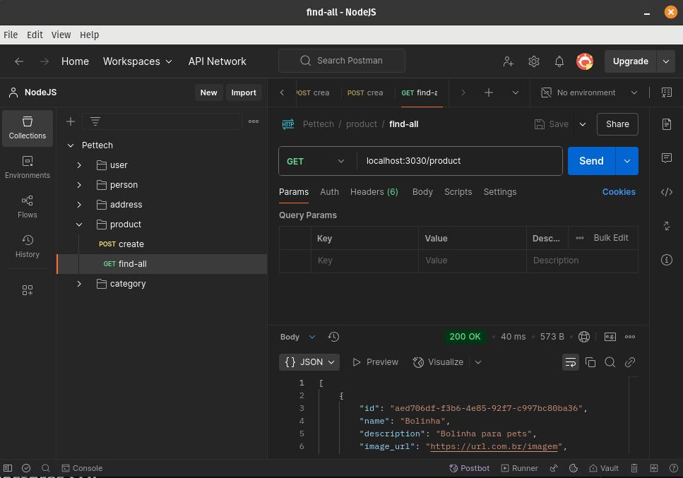  

Ao ser enviada, a requisição deverá retornar um status ```200```.  

Em seguida, crie outra requisição do tipo ```get``` para ```localhost:3030/product/a4b655ff-42b6-4dd7-b44c-1f0c0ab0fffd```.  

**Atenção:** Observe uqe o parâmetro ```ab655ff-42b6-4dd7-b44c-1f0c0ab0fffd``` em ```/product/a4b655ff-42b6-4dd7-b44c-1f0c0ab0fffd``` deve ser um ```id``` de um dos objetos recebidos na requisição anterior. Substitua adequadamente este parâmetro.  

A imagem a seguir mostra como ficará a requisição:  

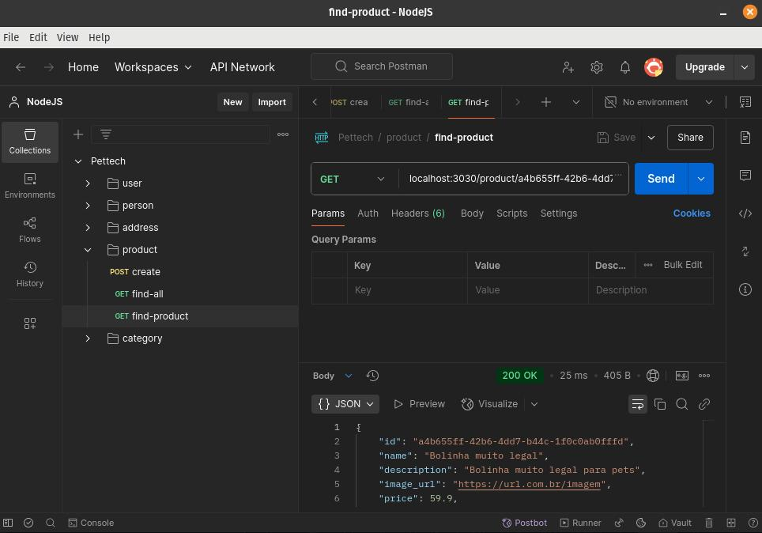  

Ao ser enviada, a requisição deverá retornar um status ```200```.  

Crie uma requisição do tipo ```put``` para a mesma rota anterior com o seguinte conteúdo no ```body```:  
<details>
<summary>Ver conteúdo</summary>  

```
{
    "name": "Bolinha muito legal atualizada",
    "description": "Bolinha muito legal para pets",
    "image_url": "https://url.com.br/imagem",
    "price": 59.9,
    "categories": [
        {
            "id": 1,
            "name": "Brinquedo Premium"
        }
    ]
}
```  
</details>

A imagem a seguir mostra como ficará a requisição:  

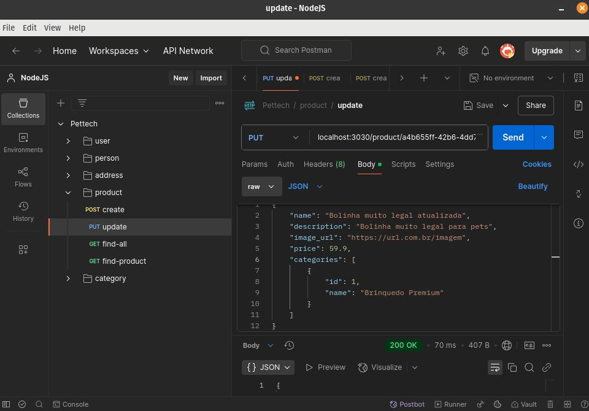  

Ao ser enviada, a requisição deverá retornar um status ```200```.  

Crie uma requisição do tipo ```delete``` para a mesma rota anterior.  

A imagem a seguir mostra como ficará a requisição:  

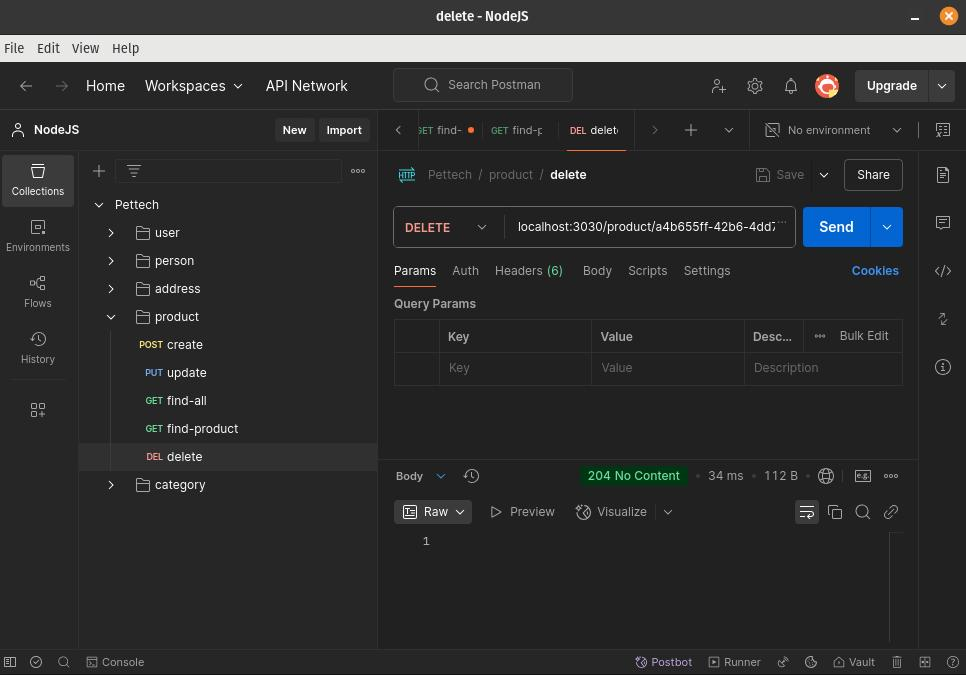  

Ao ser enviada, a requisição deverá retornar um status ```204```.  

# Adicionando autenticação:

## 63. Instale as bibliotecas necessárias:

Execute o comando no terminal na raiz do projeto:  

```npm i @fastify/jwt bcryptjs && npm i -D @types/bcryptjs```  

**@fastify/jwt** é a biblioteca que lidará com [JWT](https://pt.wikipedia.org/wiki/JSON_Web_Token).  
**bcryptjs** é uma biblioteca para gerar [hashes](https://pt.wikipedia.org/wiki/Fun%C3%A7%C3%A3o_hash) para as senhas de usuários.  
**@types/bcryptjs** ques está sendo instalado em ambiente de desenvolvimento é a biblioteca com os types utilizados pelo bcryptjs.  

## 64. Crie hashes para as senhas dos usuários:

Eite o arquivo ```/src/http/controllers/user/create.ts``` para criar hashes das senhas dos novos usuários:  

**Arquivo:** /src/http/controllers/user/create.ts  
<details>
<summary>Ver conteúdo</summary>  

```
import { makeCreateUserUseCase } from '@/use-cases/factory/make-create-user-use-case'
import { hash } from 'bcryptjs'
import { FastifyReply, FastifyRequest } from 'fastify'
import { z } from 'zod'

export async function create(request: FastifyRequest, reply: FastifyReply) {
  const registerBodySchema = z.object({
    username: z.string(),
    password: z.string(),
  })

  const { username, password } = registerBodySchema.parse(request.body)

  const hashedPassword = await hash(password, 8)

  const userWithHashedPassword = {
    username,
    password: hashedPassword,
  }

  const createUserUseCase = makeCreateUserUseCase()

  const user = await createUserUseCase.handler(userWithHashedPassword)

  return reply.status(201).send({ id: user?.id, username: user?.username })
}
```  
</details>  

Observe que a senha não faz mais parte do retorno.  

## 65. Crie a secret key para gerar os JWTs:

Edite o arquivo ```/.env``` e crie uma variável de ambiente para a secret key que será usada para gerar os JWTs:  

**Arquivo:** /.env  
<details>
<summary>Ver conteúdo</summary>  

```
PORT=3030
ENV=development
DATABASE_USER=seu-nome-de-usuario
DATABASE_HOST=localhost
DATABASE_NAME=nome-do-seu-banco
DATABASE_PASSWORD=sua-senha
DATABASE_PORT=5432
JWT_SECRET=sua-secret-key
```  
</details>  

O valor de ```JWT_SECRET``` é uma ```string``` que você deverá definir.  

Edite o arquivo ```/.env.example``` e insira ```JWT_SECRET```:  

**Arquivo:** /.env.example  
<details>
<summary>Ver conteúdo</summary>  

```
PORT=
ENV=
DATABASE_USER=
DATABASE_HOST=
DATABASE_NAME=
DATABASE_PASSWORD=
DATABASE_PORT=
JWT_SECRET=
```  
</details>  

Adicione ```JWT_SECRET``` ao ```envSchema```:  

**Arquivo:** /src/env/index.ts  
<details>
<summary>Ver conteúdo</summary>  

```
import 'dotenv/config'

import { z } from 'zod'

const envSchema = z.object({
  NODE_ENV: z
    .enum(['development', 'test', 'production'])
    .default('development'),
  PORT: z.coerce.number().default(3030),
  DATABASE_USER: z.string(),
  DATABASE_HOST: z.string(),
  DATABASE_NAME: z.string(),
  DATABASE_PASSWORD: z.string(),
  DATABASE_PORT: z.coerce.number(),
  JWT_SECRET: z.string(),
})

const _env = envSchema.safeParse(process.env)

if (!_env.success) {
  console.error('Invalid environment variables', _env.error.format())

  throw new Error('Invalid environment variables')
}

export const env = _env.data
```  
</details>  

## 66. Configure o JWT:

Edite o arquivo ```/src/app.ts``` para configurar o JWT:  

**Arquivo:** /src/app.ts  
<details>
<summary>Ver conteúdo</summary>  

```
import 'reflect-metadata'
import '@/lib/typeorm/typeorm'
import fastify from 'fastify'
import { personRoutes } from '@/http/controllers/person/routes'
import { userRoutes } from './http/controllers/user/routes'
import { globalErrorHandler } from './utils/global-error-handler'
import { addressRoutes } from './http/controllers/address/routes'
import { productRoutes } from './http/controllers/product/routes'
import { categoryRoutes } from './http/controllers/category/routes'
import fastifyJwt from '@fastify/jwt'
import { env } from './env'

export const app = fastify()

app.register(fastifyJwt, {
  secret: env.JWT_SECRET,
  sign: {
    expiresIn: '10m',
  },
})

app.register(personRoutes)
app.register(userRoutes)
app.register(addressRoutes)
app.register(productRoutes)
app.register(categoryRoutes)

app.setErrorHandler(globalErrorHandler)
```  
</details>  

## 67. Crie um middleware para autenticar o usuário:

Crie o diretório ```/src/http/middlewares```.  

Nele, crie o arquivo```/src/http/middlewares/jwt-validate.ts``` responsável pela validação do JWT.  

**Arquivo:** /src/http/middlewares/jwt-validate.ts  
<details>
<summary>Ver conteúdo</summary>  

```
import { FastifyReply, FastifyRequest } from 'fastify'

export async function validateJwt(
  request: FastifyRequest,
  reply: FastifyReply,
) {
  try {
    const route = request.routeOptions.url
    const method = request.method

    if (route === '/user' && method === 'POST') {
      return
    }

    await request.jwtVerify()
  } catch (error) {
    reply.status(401).send({ message: 'Unauthorized' })
  }
}
```  
</details>  

Adicione o middleware em ```/src/app.ts``` para que ele seja executado a cada requisição:  

**Arquivo:** /src/app.ts  
<details>
<summary>Ver conteúdo</summary>  

```
import 'reflect-metadata'
import '@/lib/typeorm/typeorm'
import fastify from 'fastify'
import { personRoutes } from '@/http/controllers/person/routes'
import { userRoutes } from './http/controllers/user/routes'
import { globalErrorHandler } from './utils/global-error-handler'
import { addressRoutes } from './http/controllers/address/routes'
import { productRoutes } from './http/controllers/product/routes'
import { categoryRoutes } from './http/controllers/category/routes'
import fastifyJwt from '@fastify/jwt'
import { env } from './env'
import { validateJwt } from './http/middlewares/jwt-validate'

export const app = fastify()

app.register(fastifyJwt, {
  secret: env.JWT_SECRET,
  sign: {
    expiresIn: '10m',
  },
})

app.addHook('onRequest', validateJwt)

app.register(personRoutes)
app.register(userRoutes)
app.register(addressRoutes)
app.register(productRoutes)
app.register(categoryRoutes)

app.setErrorHandler(globalErrorHandler)
```  
</details>  

## 68. Crie um use case de autenticação:

Edite o arquivo ```/src/repositories/user.repository.interface.ts``` e crie a assinatura do método ```findByUsername```:  

**Arquivo:** /src/repositories/user.repository.interface.ts  
<details>
<summary>Ver conteúdo</summary>  

```
import { IPerson } from '@/entities/models/person.interface'
import { IUser } from '@/entities/models/user.interface'

export interface IUserRepository {
  findWithPerson(userId: number): Promise<(IUser & IPerson) | undefined>
  create(user: IUser): Promise<IUser | undefined>
  findByUsername(username: string): Promise<IUser | undefined>
}
```  
</details>  

Implemente o novo método em ```/src/repositories/pg/user.repository.ts```:  

**Arquivo:** /src/repositories/pg/user.repository.ts  
<details>
<summary>Ver conteúdo</summary>  

```
import { database } from '@/lib/pg/db'
import { IUserRepository } from '../user.repository.interface'
import { IUser } from '@/entities/models/user.interface'
import { IPerson } from '@/entities/models/person.interface'

export class UserRepository implements IUserRepository {
  public async create({
    username,
    password,
  }: IUser): Promise<IUser | undefined> {
    const result = await database.clientInstance?.query<IUser>(
      `INSERT INTO "user" (username, password) VALUES ($1, $2) RETURNING *`,
      [username, password],
    )

    return result?.rows[0]
  }

  public async findWithPerson(
    userId: number,
  ): Promise<(IUser & IPerson) | undefined> {
    const result = await database.clientInstance?.query(
      `SELECT * FROM "user" 
      LEFT JOIN "person" ON "user"."id" = "person"."user_id"
      WHERE "user"."id" = $1`,
      [userId],
    )

    return result?.rows[0]
  }

  public async findByUsername(username: string): Promise<IUser | undefined> {
    const result = await database.clientInstance?.query<IUser>(
      `SELECT * FROM "user" WHERE "user".username = $1`,
      [username],
    )

    return result?.rows[0]
  }
}
```  
</details>  

Crie um erro para credenciais inválidas em ```/src/use-cases/errors/invalid-credentials-error.ts```:  

**Arquivo:** /src/use-cases/errors/invalid-credentials-error.ts  
<details>
<summary>Ver conteúdo</summary>  

```
export class InvalidCredentialsError extends Error {
  constructor() {
    super('Invalid username or password')
  }
}
```  
</details>  

Registre o novo erro em ```/src/utils/global-error-handler.ts```:  

**Arquivo:** /src/utils/global-error-handler.ts  
<details>
<summary>Ver conteúdo</summary>  

```
import { env } from '@/env'
import { FastifyReply, FastifyRequest } from 'fastify'
import { ZodError } from 'zod'

interface ErrorHandlerMap {
  [key: string]: (
    error: Error | ZodError,
    _: FastifyRequest,
    reply: FastifyReply,
  ) => void
}

export const errorHandlerMap: ErrorHandlerMap = {
  ZodError: (error, _, reply) => {
    return reply.status(400).send({
      message: 'Validation error',
      ...(error instanceof ZodError && { errors: error.format() }),
    })
  },
  ResourceNotFoundError: (error, __, reply) => {
    return reply.status(404).send({
      message: error.message,
    })
  },
  InvalidCredentialsError: (error, __, reply) => {
    return reply.status(404).send({
      message: error.message,
    })
  },
}

export const globalErrorHandler = (
  error: Error,
  _: FastifyRequest,
  reply: FastifyReply,
) => {
  if (env.NODE_ENV === 'development') {
    console.error(error)
  }

  const handler = errorHandlerMap[error.constructor.name]

  if (handler) {
    return handler(error, _, reply)
  }

  return reply.status(500).send({
    message: 'Internal server error',
  })
}
```  
</details>  

Crie o use case para sign-in:  

**Arquivo:** /src/use-cases/signin.ts  
<details>
<summary>Ver conteúdo</summary>  

```
import { IUserRepository } from '@/repositories/user.repository.interface'
import { InvalidCredentialsError } from './errors/invalid-credentials-error'

export class SigninUseCase {
  constructor(private userRepository: IUserRepository) {}

  async handler(username: string) {
    const user = await this.userRepository.findByUsername(username)

    if (!user) {
      throw new InvalidCredentialsError()
    }

    return user
  }
}
```  
</details>  

Crie uma factory para a nova use case:  

**Arquivo:** /src/use-cases/factory/make-signin-use-case.ts  
<details>
<summary>Ver conteúdo</summary>  

```
import { UserRepository } from '@/repositories/pg/user.repository'
import { SigninUseCase } from '../signin'

export function makeSigninUseCase() {
  const userRepository = new UserRepository()

  const signinUseCase = new SigninUseCase(userRepository)

  return signinUseCase
}
```  
</details>

Crie uma controller para exectuar a factory:  

**Arquivo:** /src/http/controllers/user/signin.ts  
<details>
<summary>Ver conteúdo</summary>  

```
import { InvalidCredentialsError } from '@/use-cases/errors/invalid-credentials-error'
import { makeSigninUseCase } from '@/use-cases/factory/make-signin-use-case'
import { compare } from 'bcryptjs'
import { FastifyReply, FastifyRequest } from 'fastify'
import { z } from 'zod'

export async function signin(request: FastifyRequest, reply: FastifyReply) {
  const registerBodySchema = z.object({
    username: z.string(),
    password: z.string(),
  })

  const { username, password } = registerBodySchema.parse(request.body)

  const signinUseCase = makeSigninUseCase()

  const user = await signinUseCase.handler(username)

  const doesPasswordsMatch = await compare(password, user.password)

  if (!doesPasswordsMatch) {
    throw new InvalidCredentialsError()
  }

  const token = await reply.jwtSign({ username })

  return reply.status(200).send({ token })
}
```  
</details>  

Registre a rota para a nova controller em ```/src/http/controllers/user/routes.ts```:  

**Arquivo:** /src/http/controllers/user/routes.ts  
<details>
<summary>Ver conteúdo</summary>  

```
import { FastifyInstance } from 'fastify'
import { create } from './create'
import { findUser } from './find-user'
import { signin } from './signin'

export async function userRoutes(app: FastifyInstance) {
  app.get('/user/:id', findUser)
  app.post('/user', create)
  app.post('/user/signin', signin)
}
```  
</details>  

Edite o arquivo o middleware ```/src/http/middlewares/jwt-validate.ts``` para liberar a rota de signin:  

**Arquivo:** /src/http/middlewares/jwt-validate.ts  
<details>
<summary>Ver conteúdo</summary>  

```
import { FastifyReply, FastifyRequest } from 'fastify'

export async function validateJwt(
  request: FastifyRequest,
  reply: FastifyReply,
) {
  try {
    const routeFreeList = ['POST-/user', 'POST-/user/signin']
    const validateRoute = `${request.method}-${request.routeOptions.url}`

    if (routeFreeList.includes(validateRoute)) {
      return
    }

    await request.jwtVerify()
  } catch (error) {
    reply.status(401).send({ message: 'Unauthorized' })
  }
}
```  
</details>  

## 69. Utilize o Postman para testar a rota criada:

Após executar o comando ```npm run start:dev```, crie no [Postman](https://www.postman.com/downloads/) uma requisição do tipo ```post``` para ```localhost:3030/user/signin``` com o seguinte conteúdo no ```body```:  

<details>
<summary>Ver conteúdo</summary>  

```
{
    "username": "feltrano@emial.com",
    "password": "feltrano"
}
```  
</details>  

**Importante:** Troque os valores associados às chaves ```username``` e ```password``` por credenciais salvas no seu banco. Caso necessário, [crie um novo usuário](#29-utilize-o-postman-para-testar-a-criação-de-user).  

A imagem a seguir mostra como ficará a requisição:  

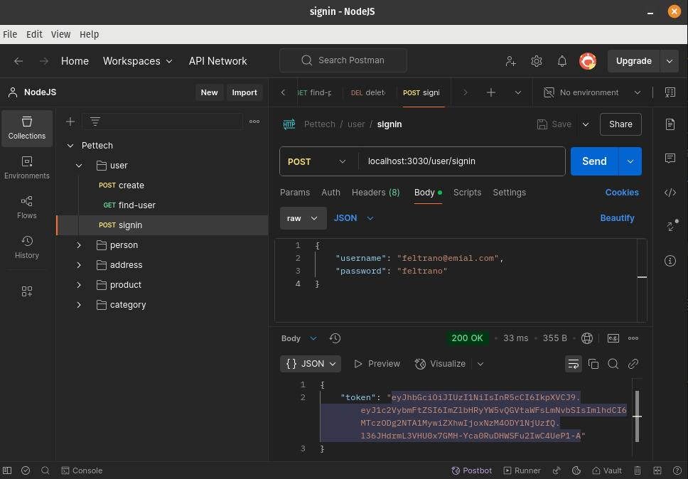  

Ao ser enviada, a requisição deverá retornar um status ```200```.  

Copie o token retornado.  

Faça uma nova requisição do tipo ```get``` para ```localhost:3030/user/7``` inserindo o token conforme indicado na imagem da requisição a seguir que ao ser enviada deverá retornar um status ```200```.  

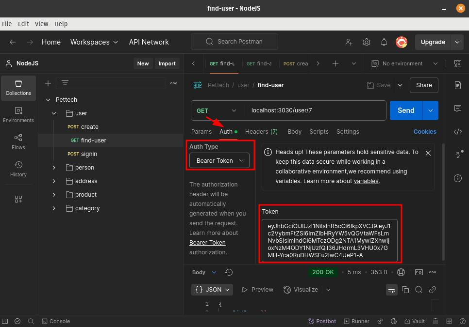  

**Importante:** o ```7``` em ```/user/7``` deve ser uma ```id``` válida na tabela ```user```. Se necessário, toque este parâmetro por um valor válido.  